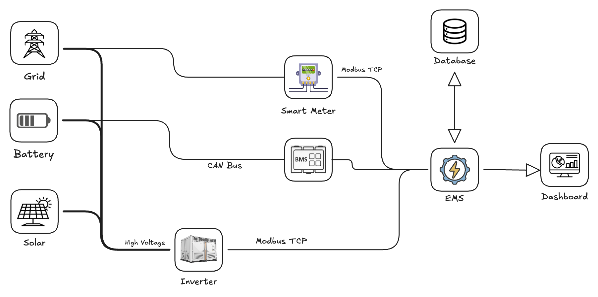

# Energy Management System

An EMS is defined as a computer aided tool used by operators of electric utility grids to monitor, control and optimize the perfomance of the generation and transmission system.

### Functional Definition
At it's core, an EMS is a closed-loop-control system that manages the "Trilemma" of energy: **Cost, Comfort and Carbon**.

- **Monitoring**: Collecting real-time data from hardware like Meters (grid flow) and BMS (Battery health).

- **Analysis**: Using logic or algorithms to predict future needs based on historical usage and weather forecasts.

- **Optimization**: Determining the most efficient way to use available energy (e.g., Should I use the battery now or save it for later tonight?).

- **Control**: Sending specific "Setpoints" to inverters and chargers to physically move the power.

**State of Charge**: State of Charge (SOC) represents the current available energy in the battery relative to its maximum usable capacity. It is the level of charge of an electric battery relative to its capacity.

State of Charge (SOC) is the equivalent of a fuel gauge for a battery pack in an electric vehicle or electronic device. It is typically expressed as a percentage:

- **100% SOC**: The battery is completely full.
- **0% SOC**: The battery is completely empty.

Technically, SOC is the ratio of the remaining capacity ($Q_{rem}$) to the maximum capacity ($Q_{max}$) that the battery can currently hold:

$$
SOC(t) = \frac{Q_{remaining}(t)}{Q_{max}(t)} \times 100\%
$$

There is no specific sensor that can reach inside a battery to check the charge, BMS uses estimation methods like: 

- Voltage Checks
- Coulomb Counting
- Kalman Filtering

**State of Health**: In simple words, SOH can be said as the battery life, that depricates in a long term. State of Health indicates the overall health and aging condition of the battery compared to when it was new which reflects in

- capacity degration 
- increase in internal resistance .
- remaining useful life.

Same like SOC State of Health is estimated using 

- Charge & discharge current (Coulomb Counting)
- Voltage response
- Temperature History
- Cycle Count and Depth of discharge
- Aging Models/ Kalman Filters

**Calculation**: 

$$
SOH = \dfrac{\text{Current usable capacity}}{\text{Rated capacity}} \times 100
$$

**Cell Balancing**: Cell balancing ensures that all individual cells in a battery pack maintain similar voltages and SOC levels, preventing overcharge or over-discharge of weaker cells. When there is variants in the battery charges, the BMS equalizes the charge between the battery packs with an average.

**AC and DC Conversion** 

- **AC to DC Conversion**: When a battery is charged from the grid or AC source, AC power is converted to DC power, which is called as Rectification. This is happened as the grid discharges AC power while the battery stores DC power.

- **DC to AC Conversion**: When a battery supplies power to devices, battery outputs DC, and converted to AC, this process is called inversion which is performed by an inverter.

**Real Time Power Flow**: In an Energy Storage System (ESS), real-time power flow is the live tracking of where energy is coming from and where it is going. It refers to the continuous monitoring and streaming of electrical parameters from the battery and power system with minimal latency.

**Communication through Protocols**: Communication protocols can be said as the language that defines the rules, message structure, timing and data formats which allows different devices to exchange data reliably/communication.

**Master Slave Procotol**: Modbus TCP Master–Slave is a communication model where a central controller (Master) actively requests data, and field devices (Slaves) respond with measured or stored values over Ethernet. In this, the Master(Client) initiates the communication, and sends requests where the Slave(Server) only responds to those requests, said to be data communication.

**Read/Write to a Specific Address**: n Modbus TCP, every data point (voltage, current, SOC, status, command) is stored at a specific register address inside the slave device.

The Master (EMS / PLC / SCADA):

- Reads data from these addresses.
- Writes data to these addresses to control the device.

**Data Frames**: In a CAN Bus (Controller Area Network) system, the Data Frame is the most common type of message. It is the workhorse that actually carries information—like battery voltage from a BMS or speed from a motor controller—between different nodes on the network.

Unlike Modbus TCP, which uses IP addresses, CAN Bus uses Arbitration IDs. These IDs serve two purposes: they identify what the data is, and they determine which message gets priority if two devices try to talk at the exact same time.

**Data pack and Unpack**: In Modbus TCP, data packing and unpacking describe how real-world values (voltage, current, SOC, commands) are:

- Packed → Converted into raw register data and placed inside a Modbus TCP packet.
- Unpacked → Extracted from received registers and converted back into usable values.

This ensures machines can communicate numeric data correctly.

**Watchdogs**: A watchdog is a monitoring mechanism used in embedded, industrial, and energy systems to detect software or communication failures and automatically trigger protective actions. In short, a watchdog ensures the system is alive, responsive, and operating correctly.

**Communication handling with devices**: Communication handling refers to how an EMS / controller detects, manages, and safely reacts when communication with critical devices like a Battery (BMS) or Energy Meter is lost, delayed, or corrupted.
In energy systems, loss of communication is treated as a fault, not just a data issue.

**Self Consumption**: Self Consumption is an energy control strategy where locally generated energy (typically from solar PV) is used directly by on-site loads, instead of exporting it to the grid.

The battery plays a key role by:

- Storing excess energy when generation exceeds consumption.
- Supplying energy when generation is insufficient.

**Peak Shaving**: Peak Shaving is an energy control strategy where a battery system reduces short-duration high power demand (peaks) drawn from the grid by supplementing the load with battery power.

**Python Libraries**:

- **pymodbus**: pymodbus is a Python library used to implement Modbus communication (commonly Modbus TCP) between an EMS/controller and industrial devices like BMS, meters, and inverters.

- **python-can**:python-can is a Python library used for CAN bus communication, widely used in BMS internal communication, EV systems, and automotive-grade controllers.

**Time-Series Data: Pandas Library**: Time-series data is a sequence of values indexed by time.Because a BMS is constantly monitoring things like State of Charge (SOC) and Power Flow every second, you end up with a massive "mountain" of data. The Pandas library in Python is the gold-standard tool used to organize, clean, and analyze this information.
In time-series data, the Time is the ID.

- X-Axis: Always represents time (Seconds, Minutes, Hours).
- Y-Axis: Represents the value (Voltage, Temperature, 5$kW$ demand).

**Threading/Concurrency(python)**:

- **Threading**: Threading allows a Python program to run multiple tasks concurrently within the same process.
Each thread shares the same memory space, which makes coordination fast—but also risky without proper control.

- **Lock**: When multiple threads try to access the same piece of data at the exact same time, you get a "Race Condition." This can be dangerous for a battery.

The Problem: Imagine Thread A is trying to Write a new SOC value to a variable, while Thread B is trying to Read that same variable to decide if it should open a relay. If Thread B reads the value halfway through Thread A's update, the data will be "garbage."

The Solution: The Lock (threading.Lock) A Lock ensures that only one thread can touch a specific piece of data at a time. It works like a bathroom key:

1. Thread A "Acquires" the lock.

2. Thread A updates the SOC value.

3. Thread B tries to access the SOC but sees the lock is taken, so it waits.

4. Thread A "Releases" the lock.

5. Thread B now takes the key and reads the safe, updated value.