# MyEMS Module Overview  
The **MyEMS** suite organizes energy management features into focused modules. Each module lives under `src/components/MyEMS` and leverages shared utilities in `src/components/MyEMS/common`. The diagram below shows how core feature areas relate to the common toolkit and to one another.

```mermaid
flowchart TD
    subgraph MyEMS [MyEMS]
        AR[AdvancedReporting]
        AS[AuxiliarySystem]
        CE[CombinedEquipment]
        ESP[EnergyStoragePowerStation]
        EQ[Equipment]
        FDD[FaultDiagnosis]
        KB[KnowledgeBase]
        MTR[Meter]
        MG[Microgrid]
        MON[Monitoring]
        NP[Notification]
        PV[PhotovoltaicPowerStation]
        SF[Shopfloor]
        SP[Space]
        ST[Store]
        TE[Tenant]
        WO[WorkOrder]
    end

    Common[(common components)]

    AR -->|uses| Common
    AS -->|uses| Common
    CE -->|uses| Common
    ESP -->|uses| Common
    EQ -->|uses| Common
    FDD -->|uses| Common
    KB -->|uses| Common
    MTR -->|uses| Common
    MG -->|uses| Common
    MON -->|uses| Common
    NP -->|uses| Common
    PV -->|uses| Common
    SF -->|uses| Common
    SP -->|uses| Common
    ST -->|uses| Common
    TE -->|uses| Common
    WO -->|uses| Common
```



## AdvancedReporting  
The **AdvancedReporting** module delivers in-depth dashboards and KPI summaries. It manages filters, date ranges, and orchestrates multiple chart components.  

- **AdvancedReporting.js**: Main container; fetches data and controls subviews.  
  - Typically acts as a page-level route component that users navigate to from the main menu.
  - Manages shared state such as selected spaces, time ranges, and comparison types.
  - Orchestrates child components like `Summary`, charts, and data tables by passing them cleaned data and loading flags.
  - Uses utilities from `MyEMS/common` (such as `DateRangePickerWrapper`, `PeriodTypeOptions`, and chart wrappers) to keep behavior consistent with other analytical pages.
- **Summary.js**: Renders top-level KPIs in summary cards.  
  - Receives computed totals, averages, or peak values from `AdvancedReporting.js` through props.
  - Displays several numeric tiles or cards, usually with trends, percentage changes, and unit labels.
  - Often interacts with chart components indirectly by sharing the same data model or filter selections.
  - Provides a compact overview that users can scan before drilling into detailed graphs and tables.  

```js
import Summary from './Summary';
import { BarChart } from '../common/BarChart';
```

## AuxiliarySystem  
The **AuxiliarySystem** module visualizes support systems like HVAC and pumps. It offers network maps, flow diagrams, and live charts.  

- **DistributionSystem.js**: Displays system topology on a map.  
  - Presents auxiliary equipment and pipelines as nodes and connections, often overlaid on a floorplan or site map.
  - Uses components such as `AMap` or `CustomizeMapBox` from `MyEMS/common` to render geospatial or schematic layouts.
  - Highlights equipment states and alarms using colors or icons linked to real-time sensor data.
  - Often serves as an entry point to navigate into more detailed equipment or space views.
- **EnergyFlowDiagram.js**: Shows Sankey-style energy flows.  
  - Visualizes energy inputs, transformations, and outputs between auxiliary subsystems.
  - Uses either ECharts wrappers (`BarChart`, `SharePie`, or custom Sankey) or specialized flow-diagram components.
  - Emphasizes proportional flows, losses, and efficiency by rendering widths or color intensities.
  - Commonly consumes aggregated data prepared by backend APIs and normalized in the container.
- **RealtimeChart.js**: Streams live metrics in a line chart.  
  - Connects to periodic polling or WebSocket-like update mechanisms to refresh data at intervals.
  - Wraps `LineChart`, `SectionLineChart`, or `MultiTrendChart` from the common chart utilities.
  - Provides tooltips, legends, and range selectors to inspect recent performance of auxiliary equipment.
  - Often embedded below `DistributionSystem` or `EnergyFlowDiagram` to combine static topology with live data.  

## CombinedEquipment  
This module analyzes combined equipment performance across multiple dimensions. Components split into metric views and utility views.  

- **Core Metrics**  
  - `CombinedEquipmentCarbon.js`  
    - Presents carbon emissions and related KPIs for grouped equipment.
    - Uses emission factors applied to energy consumption retrieved from backend APIs.
    - Typically combines time-series emissions with summary tables of emission breakdown by category.
    - Aligns with similar carbon views from `Meter` and `Space` modules to give consistent metrics.
  - `CombinedEquipmentCost.js`  
    - Shows cost of energy consumption aggregated across multiple equipment items.
    - Applies tariff and time-of-use rules, often calculated server-side and formatted client-side.
    - Uses tables to break down cost by energy category, tariff period, or equipment group.
    - Shares filter logic with other views such as `CombinedEquipmentEnergyCategory`.
  - `CombinedEquipmentEfficiency.js`  
    - Focuses on performance indicators like kWh per unit output or efficiency ratios.
    - Plots efficiency curves and tracks deviations from design or target values.
    - Works closely with `CombinedEquipmentOutput.js` to compute denominators for efficiency metrics.
    - Often exposes benchmark lines or threshold highlighting for underperforming equipment.  

- **Comparisons & Trends**  
  - `CombinedEquipmentComparison.js`  
    - Compares consumption, cost, or other KPIs between different equipment groups or time periods.
    - Uses combination charts or multiple series in `MixedLineChart` or `MultipleLineChart`.
    - Supports comparison types defined in `ComparisonTypeOptions` (for example, year-over-year or baseline vs reporting).
    - Drives user decisions when prioritizing retrofits or optimizations across groups.
  - `CombinedEquipmentStatistics.js`  
    - Summarizes statistical indicators like min, max, average, and load factors.
    - Presents results in tables and sometimes box-plot style charts for distribution analysis.
    - Often serves as a reference panel for auditors or energy managers evaluating variability.
    - Shares data-processing helpers with other statistics components in `Meter` and `Space`.
  - `CombinedEquipmentPlan.js`  
    - Displays planned versus actual consumption or cost for combined equipment.
    - Uses stacked or overlapped charts to visualize deviation from plans or budgets.
    - Typically integrates interactive controls to switch between time scales (daily, monthly, yearly).
    - Coordinates with `CombinedEquipmentSaving.js` to quantify deviations as savings or overruns.  

- **Auxiliary Views**  
  - `CombinedEquipmentBatch.js`  
    - Supports batch analysis or batch operations for multiple combined equipment configurations.
    - Often allows exporting data to spreadsheets using shared export utilities.
    - Might render combined results in big tables with pagination via common table components.
    - Enables multi-selection of equipment groups for bulk reporting.
  - `CombinedEquipmentEnergyCategory.js`  
    - Breaks consumption into categories such as electricity, gas, water, or steam.
    - Frequently uses pie charts (`SharePie`) and stacked bars to show proportion by category.
    - Interacts with global energy category definitions shared across the entire app.
    - Helps identify which energy types dominate usage for a combined equipment set.
  - `CombinedEquipmentEnergyItem.js`  
    - Drills further into individual energy items within broader categories.
    - Useful when the same category contains several billable items or tariffs.
    - Often displays individual series in a multi-line chart for temporal comparison.
    - Reuses the same filters and date range components as the category view.
  - `CombinedEquipmentIncome.js`  
    - For revenue-generating equipment, tracks income or production value.
    - Uses revenue metrics aligned with energy inputs to compute profitability.
    - Works with `CombinedEquipmentOutput.js` to link physical output with monetary return.
    - Supports decision-making around production schedules and capacity utilization.
  - `CombinedEquipmentLoad.js`  
    - Focuses on load profiles and demand peaks of combined equipment.
    - Shows load curves and highlights maximum demand intervals.
    - Often interacts with demand-response or load-shifting optimization workflows.
    - Helps plan capacity and avoid peak demand penalties.
  - `CombinedEquipmentOutput.js`  
    - Displays physical output quantity (for example, product units or tonnage).
    - Provides baseline data used by `CombinedEquipmentEfficiency.js` and `Income` views.
    - Visualizes output trends with time-series charts and summary metrics.
    - Helps correlate process output with energy use and cost.
  - `CombinedEquipmentSaving.js`  
    - Quantifies energy or cost savings relative to baselines or plans.
    - Uses difference or ratio metrics and often displays cumulative savings.
    - Integrates with plan, comparison, and statistics data to compute savings accurately.
    - Suitable for tracking performance of energy conservation measures.
  - `CombinedEquipmentStatistics.js`  
    - Already listed under comparisons, but in practice serves both trend and summary roles.
    - Provides foundational numeric context which other components reuse for tooltips and labels.  

```js
import { MixedLineChart } from '../common/MixedLineChart';
import DetailedDataTable from '../common/DetailedDataTable';
```

## EnergyStoragePowerStation  
The **EnergyStoragePowerStation** suite covers dashboards, detail views, scheduling, and reporting for storage assets.  

- **Dashboards**  
  - `Dashboard.js`  
    - Main page for a single energy storage power station or for an aggregated view.
    - Arranges several cards such as `DetailsCard`, real-time charts, and status summaries.
    - Coordinates filter state like selected station, date range, and metric type.
    - Pulls together data from reporting components and status details into one layout.
  - `CollectionDashboard.js`  
    - Aggregated dashboard for a collection of energy storage sites.
    - Shows portfolio-level KPIs such as total capacity, total charge, and fleet state-of-charge.
    - Uses `StackBarChart` and table cards to break down results by station.
    - Often serves management users interested in cross-site performance.
  - `ItemDashboard.js`  
    - Focused dashboard for a single item or device inside a station.
    - May show battery modules, PCS, or subsystem performance metrics.
    - Embeds `DeviceStatusDetails` and parameter charts specific to that item.
    - Helps engineers troubleshoot or optimize specific hardware elements.  

- **Detail Panels**  
  - `EnergyStoragePowerStationDetails.js`  
    - Page-level or panel-level component that shows full station details.
    - Integrates `DetailsCard`, `DeviceStatusDetails`, and `ScheduleDetails`.
    - Provides navigation between sub-tabs like overview, schedule, and alarms.
    - Acts as the central detail route for jump-ins from list or map views.
  - `DetailsCard.js`  
    - Compact card with key attributes like rated power, capacity, location, and operator.
    - Consumed by both dashboards and detail pages for consistent presentation.
    - Uses shared UI components such as `FalconCardHeader` and `CardSummary`.
    - Often includes quick links or actions, for example navigate to reporting tabs.
  - `DeviceStatusDetails.js`  
    - Displays operational status, alarms, and running state of station devices.
    - Uses icons or small charts to visualize health, temperature, and connection state.
    - Consumes live or near-real-time data from backend APIs.
    - Often reused by both energy storage and photovoltaic modules for similar devices.
  - `ScheduleDetails.js`  
    - Shows configured charging and discharging schedules or strategies.
    - Visualizes schedules as time blocks or curves on charts.
    - Supports user inspection of schedule parameters and sometimes editing triggers.
    - Closely interacts with `CommandModal` when schedules translate into dispatch commands.  

- **Tables & Lists**  
  - `EnergyStoragePowerStationTable.js`  
    - Provides tabular view of multiple stations with sortable columns.
    - Uses shared table components and may support server-side pagination.
    - Allows selection of rows for navigation or bulk actions.
    - Frequently embedded inside `EnergyStoragePowerStationTableCard`.
  - `EnergyStoragePowerStationTableCard.js`  
    - Wraps the table in a card with header, filters, and export buttons.
    - Provides a visually consistent block used on dashboards or collection views.
    - Manages local UI state like expanded or collapsed sections.
    - Connects table interactions with higher-level routing or detail pages.
  - `EnergyStoragePowerStationList.js`  
    - Renders a list of stations, often used for navigation on smaller screens.
    - Displays condensed data like name, basic status, and key metrics in each row.
    - Uses `EnergyStoragePowerStationListItem` for individual entry layout.
    - Provides search, filter, or sort controls at list level.
  - `EnergyStoragePowerStationListItem.js`  
    - Presentational component for a single station row or card.
    - Shows iconography, badges, and short text summaries.
    - Emits click events used by parent list components to trigger navigation.
    - Keeps typography and spacing consistent across different list contexts.  

- **Modals & Commands**  
  - `CommandModal.js`  
    - Modal dialog for issuing control commands such as start, stop, charge, or discharge.
    - Displays configurable parameters and validates user input before submission.
    - Works closely with backend control APIs and `CommandDetails`.
    - Often logs results or shows confirmation messages through the Notification system.
  - `PinModal.js`  
    - Modal to pin or favorite a particular station or configuration.
    - Updates user preferences or bookmarks via API calls.
    - Used from list or dashboard screens to quickly mark important stations.
    - Ensures a lightweight UX without leaving the current page.
  - `CommandDetails.js`  
    - Shows detailed information about a previously sent command.
    - Lists parameters, timestamps, execution results, and any system responses.
    - Used as a drill-down from command history tables or logs.
    - Helps operators audit control actions and troubleshoot anomalies.  

- **Reporting & Charts**  
  - `EnergyStoragePowerStationReportingEnergy.js`  
    - Time-series and aggregated views of charge and discharge energy.
    - Separates charging, discharging, and standby intervals for clarity.
    - Uses shared chart components with specific energy storage styling or units.
    - Works closely with other reporting views to maintain consistent filters.
  - `EnergyStoragePowerStationReportingParameters.js`  
    - Focuses on operational parameters like SOC, voltage, current, and temperature.
    - Allows overlaying multiple parameters on the same time axis.
    - Provides engineers with detailed diagnostics of system behavior.
    - Uses `MultiTrendChart` or `MultipleLineChart` to manage many series.
  - `EnergyStoragePowerStationReportingRevenue.js`  
    - Tracks revenue from energy arbitrage, ancillary services, or tariff optimization.
    - Converts energy movement and market prices into monetary values.
    - Presents both cumulative and per-interval revenue charts and tables.
    - Aligns with cost and income calculations from other parts of the platform.
  - `StackBarChart.js`  
    - Specialized stacked bar chart component tailored to storage use cases.
    - Encapsulates ECharts or similar configuration for quickly rendering energy components.
    - Used by dashboards and reporting components needing stacked charts.
    - Accepts standardized props for labels, units, and tooltips.  

- **Footer**  
  - `EnergyStoragePowerStationFooter.js`  
    - Common footer section for station-related pages.
    - Might display legal notices, data source information, or connectivity status.
    - Helps ensure consistent bottom-area layout and spacing.
    - Often reused across detail and dashboard views.  

## Equipment  
Focused on single-equipment analytics, this module mirrors CombinedEquipment at the equipment level.  

- **Metrics & Savings**  
  - `EquipmentCarbon.js`  
    - Shows carbon emissions produced by a single piece of equipment.
    - Uses emission factors and meter readings mapped to that equipment.
    - May provide per-unit-of-output emissions as an intensity indicator.
    - Integrates with export and reporting flows for sustainability audits.
  - `EquipmentCost.js`  
    - Displays cost attributed to a specific equipment asset.
    - Breaks down cost by time-of-use, tariff, or energy category.
    - Supports side-by-side comparison between reporting and baseline periods.
    - Shares UI patterns with `MeterCost` and `SpaceCost` for familiarity.
  - `EquipmentEfficiency.js`  
    - Tracks equipment efficiency over time and versus design spec.
    - Uses production or service output metrics in the denominator.
    - Highlights low-efficiency periods that might require maintenance.
    - Works with maintenance and WorkOrder modules indirectly via KPIs.
  - `EquipmentSaving.js`  
    - Reports savings from equipment-level improvements or operational changes.
    - Uses baseline models or pre-retrofit data for comparison.
    - Displays savings as absolute values and percentages of baseline.
    - Useful for energy performance contract tracking.  

- **Trend & Comparison**  
  - `EquipmentComparison.js`  
    - Enables comparative analysis between different time frames for the same equipment.
    - Uses shared `ComparisonTypeOptions` component to select comparison mode.
    - Visualizes differences in energy use, cost, or emissions via overlapping charts.
    - Often includes numerical summaries of improvement or degradation.
  - `EquipmentStatistics.js`  
    - Summary statistics like peak demand, average load, and operating hours.
    - Often powered by pre-aggregated stats from backend services.
    - Presents statistics in tables, with options to export for offline analysis.
    - Supports engineers and analysts performing detailed performance reviews.
  - `EquipmentTracking.js`  
    - Tracks equipment usage patterns relative to production schedules.
    - May include on/off status charts, runtime counters, and utilization ratios.
    - Useful to detect idle running or inefficient scheduling.
    - Often linked to alerting or optimization tools for further actions.  

- **Views & Categories**  
  - `EquipmentBatch.js`  
    - Batch view or batch operations for multiple equipment items.
    - Often used to run reports, export, or configure multiple assets at once.
    - Uses generic batch components and HTTP calls for data retrieval.
    - Helps reduce repetitive steps for administrators.
  - `EquipmentEnergyCategory.js`  
    - Disaggregates equipment energy use by energy category.
    - Uses pies and stacked bars to show relative contributions.
    - Shares the same category taxonomy as meters and spaces.
    - Assists in understanding which resource drives equipment costs most.
  - `EquipmentEnergyItem.js`  
    - Further details energy items within categories for the equipment.
    - Helps connect technical readings with billing items.
    - Supports root-cause analysis for unusual bills or spikes.
    - Uses consistent layout with other `EnergyItem` components.
  - `EquipmentIncome.js`  
    - Shows income or value generated by the equipment, where applicable.
    - Supports ROI and payback calculations when combined with cost data.
    - May show price curves or product sales derived from equipment output.
    - Useful for production-heavy or revenue-generating equipment.
  - `EquipmentLoad.js`  
    - Presents load profile of an individual equipment.
    - Highlights peak loads and demand shaping opportunities.
    - Often used with alarms when demand exceeds thresholds.
    - Works closely with `PowerQuality` and `MeterTrend` for deeper dives.
  - `EquipmentOutput.js`  
    - Tracks operational output like production volume or service units.
    - Helps correlate energy consumption with output for benchmarking.
    - Provides data used in efficiency and income calculations.
    - Uses standard chart components for time-series visualization.
  - `EquipmentPlan.js`  
    - Shows planned versus actual metrics at the equipment level.
    - Helps align operational plans with real behavior.
    - Often supports editing or uploading plan values from external files.
    - Used by planners and managers to monitor adherence to targets.  

## FaultDiagnosis (FDD)  
A single component drives the fault detection and diagnosis interface.  

- **Fault.js**: Lists and details system faults; integrates with chart utilities.  
  - Displays active and historical faults for equipment, spaces, or meters.
  - Provides filtering by severity, time range, and system area.
  - May render fault timelines or statistics using chart components.
  - Links to WorkOrder components for inspection and repair follow-up.  

## KnowledgeBase  
Provides a searchable repository of guidance articles.  

- **KnowledgeBase.js**: Main article listing and search interface.  
  - Fetches and renders categorized knowledge articles, FAQs, or procedures.
  - Implements search and filter controls for quick access to relevant topics.
  - Uses card or list layouts for article summaries with links to full content.
  - Helps operators and analysts quickly find recommended practices.
- **Summary.js**: Highlights featured articles and key topics.  
  - Displays top or frequently accessed articles in a condensed view.
  - Often appears in dashboards as a quick help or tips panel.
  - Uses badges or tags to categorize content by system area.
  - Encourages users to explore documentation relevant to current tasks.  

## Meter  
Manages a variety of meter types—physical, virtual, and offline—with real-time and historical analysis.  

- **Realtime & Trends**  
  - `MeterRealtime.js`  
    - Page-level view for real-time readings from a specific meter.
    - Shows current values, status, and sometimes small trend windows.
    - Works closely with `RealtimeChart.js` to plot fast-updating data.
    - Integration point for alarms or warning indicators.
  - `RealtimeChart.js`  
    - Standalone chart component optimized for frequent updates.
    - Accepts time-series props and re-renders efficiently as new points arrive.
    - Used by multiple realtime views, not just meters.
    - Encapsulates chart configuration to keep code DRY.
  - `MeterTrend.js`  
    - Historical trend of meter readings over longer periods.
    - Supports zooming, panning, and switching between metrics or phases.
    - Uses shared line chart utilities to align UI across modules.
    - Good starting point for investigating anomalies or seasonal patterns.  

- **Usage Metrics**  
  - `MeterEnergy.js`  
    - Main energy consumption view for a meter.
    - Shows kWh or equivalent metrics in charts and daily or monthly tables.
    - Often includes cumulative and per-interval views.
    - Shared logic with `OfflineMeterEnergy` and `VirtualMeterEnergy`.
  - `MeterCost.js`  
    - Displays billing cost based on meter usage.
    - Applies tariff structures and shows breakdown by tariff periods.
    - Useful for billing verification or cost allocation.
    - Works with plan and saving components to derive savings.
  - `MeterSaving.js`  
    - Highlights savings at individual meter level.
    - Baselines may be previous periods or model-based.
    - Indicates both absolute and percentage savings.
    - Often used when meters track retrofitted circuits.
  - `MeterCarbon.js`  
    - Shows carbon emissions based on meter energy data.
    - Applies emission coefficients by energy type.
    - Often used in sustainability reporting or compliance.
    - Shares visualization patterns with `EquipmentCarbon`.  

- **Comparisons & Balances**  
  - `MeterComparison.js`  
    - Compares meter data across time or between meters.
    - Uses common comparison patterns across MyEMS modules.
    - Helps identify abnormal behavior relative to similar meters.
    - Integrates with data-export utilities for offline comparisons.
  - `MeterSubmetersBalance.js`  
    - Compares main meter consumption with sum of submeters.
    - Visualizes balance and potential unmetered or loss components.
    - Uses stacked charts and balance tables.
    - Supports energy audit workflows by highlighting discrepancies.
  - `MeterTracking.js`  
    - Monitors meter performance and usage patterns.
    - Logs missing data periods or communication issues.
    - Often displays status flags or uptime percentages.
    - Helpful for data quality assurance before analysis.  

- **Offline Meters**  
  - `OfflineMeterBatch.js`  
    - Batch input or management for meters not automatically connected.
    - Allows uploading or editing readings manually.
    - Uses data tables with inline editing or import features.
    - Ensures offline meters integrate with standard reports.
  - `OfflineMeterEnergy.js`  
    - Energy view similar to `MeterEnergy` but based on manually entered data.
    - Validates input and indicates missing periods.
    - Uses same charts and tables as online meters.
    - Ensures offline devices are not excluded from analytics.
  - `OfflineMeterInput.js`  
    - UI for entering readings for offline meters.
    - Supports form-based and possibly file-based entry modes.
    - Performs input validation and error feedback to users.
    - Connects to backend APIs for saving input data.
  - `OfflineMeterPlan.js`  
    - Plan vs actual view specific to offline meters.
    - Supports planning consumption when automatic data is unavailable.
    - Works closely with energy and saving views.
    - Uses same plan schema as other modules for consistency.
  - `OfflineMeterCost.js`  
    - Cost analytics for offline meters.
    - Applies tariffs to manually entered consumption data.
    - Mirrors `MeterCost` UI for user familiarity.
    - Useful where billing requires offline aggregation.
  - `OfflineMeterSaving.js`  
    - Saving analytics for offline meters.
    - Uses baselines built from previously entered data.
    - Provides savings results aligned with online meter calculations.
    - Ensures offline retrofits remain measurable.
  - `OfflineMeterCarbon.js`  
    - Emission calculations for offline meters.
    - Uses same factors as online meter carbon views.
    - Keeps sustainability metrics complete even for manual data.
    - Integrates with carbon reports at higher aggregation levels.  

- **Virtual Meters**  
  - `VirtualMeterBatch.js`  
    - Batch configuration or management of virtual meters.
    - Allows building meters from formulas or combinations of other meters.
    - Uses form components and validation for virtual meter definitions.
    - Enables scalable creation of derived metrics.
  - `VirtualMeterEnergy.js`  
    - Energy consumption based on computed virtual readings.
    - Shows combined or derived profiles from source meters.
    - Follows same visualization model as physical meters.
    - Useful for tenant aggregation, system boundaries, and KPIs.
  - `VirtualMeterPlan.js`  
    - Plan vs actual for virtual meters.
    - Helps track how virtual boundaries perform against budgets.
    - Ties into saving and cost modules for complete financial views.
    - Often uses plan data derived from business rules rather than manual entry.
  - `VirtualMeterCost.js`  
    - Cost analytics for virtual meter boundaries.
    - Aggregates cost from underlying meters or costs computed per formula.
    - Presents breakdowns aligned with tenant or space allocations.
    - Useful for cost allocation scenarios.
  - `VirtualMeterSaving.js`  
    - Savings view for virtual groupings or synthetic meters.
    - Allows estimation of savings at boundaries like departments or processes.
    - Mirrors online meter saving UI.
    - Supports dashboards at more abstract layers.
  - `VirtualMeterCarbon.js`  
    - Carbon emissions from virtual meter energy usage.
    - Summarizes emissions across meter groups or logical boundaries.
    - Aligns with corporate reporting boundaries.
    - Reuses chart patterns from other carbon views.
  - `VirtualMeterComparison.js`  
    - Compares virtual meters or virtual vs physical for validation.
    - Helps verify formulas and boundaries against actual data.
    - Useful to tune virtual meter definitions.
    - Integrates with standard comparison tools.  

- **Power Quality**  
  - `PowerQuality.js`  
    - Visualizes voltage, current, harmonics, and power factor data.
    - Often uses specialized charts or multiple Y-axes.
    - Helps electrical engineers diagnose quality issues.
    - Supports drill-down from alarms or threshold violations.  

## Microgrid  
Supports microgrid asset dashboards, reporting, and configuration.  

- **UI Elements**  
  - `CardDropdown.js`  
    - Reusable dropdown menu inside microgrid cards.
    - Offers per-card actions such as refresh, export, or navigation.
    - Keeps interaction pattern consistent across microgrid widgets.
    - Often receives action handlers via props from parent dashboards.
  - `CollectionDashboard.js`  
    - Aggregated dashboard for multiple microgrid systems.
    - Provides high-level KPIs like sum of PV, storage, and load.
    - Uses charts and tables to break down performance by microgrid.
    - Typically consumed by higher-level management views.
  - `Dashboard.js`  
    - Main dashboard for an individual microgrid.
    - Arranges cards for generation, storage, load, and grid interaction.
    - Shares layout concepts with storage and PV dashboards.
    - Acts as an entry point to details and reporting views.
  - `ItemDashboard.js`  
    - Focused view for a specific item in a microgrid, such as a generator or load.
    - Shows live status, trends, and configuration details.
    - Often embedded inside details pages as a nested dashboard.
    - Facilitates fine-grained analysis at component level.  

- **Data Tables**  
  - `DetailsTable.js`  
    - Presents microgrid-related metrics or configuration parameters in table form.
    - May cover device statuses, setpoints, or historical records.
    - Uses reusable table utilities for sorting and exporting.
    - Appears in both dashboards and dedicated detail pages.
  - `MicrogridTable.js`  
    - General-purpose table listing microgrids or microgrid sessions.
    - Contains key identifiers, statuses, and summary KPIs.
    - Integrates row actions to open detailed views.
    - Typically wrapped by `MicrogridTableCard` for UI consistency.
  - `MicrogridTableCard.js`  
    - Card wrapper for `MicrogridTable`.
    - Adds header, filters, and extra actions like export.
    - Encapsulates repeated styling and spacing.
    - Simplifies embedding the table in multiple pages.  

- **Lists & Footers**  
  - `MicrogridList.js`  
    - List-based navigation of microgrids, useful on smaller screens.
    - Consumes `MicrogridListItem` to render each entry.
    - Supports searching and filtering by microgrid properties.
    - Often used in sidebars.
  - `MicrogridListItem.js`  
    - Individual list item layout for a microgrid.
    - Displays name, key status indicators, and quick metrics.
    - Emits user interaction events to the parent list.
    - Maintains uniform look across lists and dropdowns.
  - `MicrogridFooter.js`  
    - Reusable bottom section for microgrid-related pages.
    - Can show data source notes, synchronization state, or quick help.
    - Encourages consistent UX regarding footer information.
    - Simple but centralizes responsibility for that page area.  

- **Reporting Modules**  
  - `MicrogridReportingEnergy.js`  
    - Presents energy flows and balances inside the microgrid.
    - Shows generation, storage usage, imports, and exports.
    - Often uses stacked bar or Sankey-style charts.
    - Helps understand overall microgrid energy behavior.
  - `MicrogridReportingParameters.js`  
    - Displays operational parameters like voltages, currents, and state-of-charge.
    - Allows overlaying multiple parameters per device or per bus.
    - Supports engineers analyzing technical performance.
    - Often shares chart wrappers with energy storage reporting modules.
  - `MicrogridReportingRevenue.js`  
    - Shows revenue from exports or cost savings from self-consumption.
    - Breaks revenue by energy source or market program.
    - Uses both time-series and aggregated views.
    - Useful for financial evaluation of microgrid projects.  

- **Charts**  
  - `StackBarChart.js`  
    - Microgrid-specific stacked bar chart component.
    - Encapsulates color schemes and label formats suitable for microgrid use.
    - Used by energy and revenue reporting views.
    - Accepts generic props so other modules can reuse it if needed.  

## Monitoring  
Aggregates equipment and space monitoring into unified views.  

- **CombinedEquipments.js**: Multi-equipment live view.  
  - Shows status or real-time KPIs for multiple equipment simultaneously.
  - Uses list or grid layouts with per-equipment mini charts or gauges.
  - Supports filtering by space, type, or tag.
  - Useful as an operational command center view.
- **EquipmentFooter.js**: Persistent controls for monitoring views.  
  - Renders controls like page size, quick filters, or summary information.
  - Stays visible while content scrolls, depending on layout.
  - Reused across different monitoring screens for consistency.
  - Keeps navigation and key actions at users’ fingertips.
- **EquipmentList.js**: Catalog of monitored devices.  
  - Lists monitored equipment with essential data and statuses.
  - Integrates with selection and navigation to details or dashboards.
  - Supports search and filtering across multiple attributes.
  - Basis for drill-down workflows from broad monitoring views.
- **SpaceEquipments.js**: Devices within a given space.  
  - Filters the equipment list by a specific space or zone.
  - Combines space tree selection with equipment listing.
  - Helps facility staff see all assets in a physical area.
  - Often used together with `ChildSpacesTable` from common components.
- **equipments.js**: Shared data hooks.  
  - Likely contains helper functions, configuration, or mock data for equipment monitoring.
  - Keeps data structures consistent between list, combined, and space views.
  - Reduces duplication of mapping logic between API responses and UI props.
  - Centralizes queries or transformation utilities.  

## Notification  
Handles in-app alerts and toasts.  

- **Notification.js**: Global notification dispatcher and renderer.  
  - Wraps a notification system such as toast or alert stack.
  - Exposes functions or context to trigger notifications from anywhere.
  - Configures severity levels, auto-dismiss behavior, and positions.
  - Used extensively by forms, modals, and long-running operations.  

## PhotovoltaicPowerStation  
Mirrors EnergyStoragePowerStation for PV assets, adding inverter and meter details.  

- **Dashboard & Collection**  
  - `Dashboard.js`  
    - Main operational dashboard for a photovoltaic power station.
    - Shows generation curves, performance ratios, and weather correlations.
    - Composes detail cards, charts, and tables in a unified layout.
    - Often first page operators see for PV sites.
  - `CollectionDashboard.js`  
    - Aggregated view of multiple PV stations.
    - Summarizes total generation, performance, and alarms across portfolio.
    - Uses charts such as stacked bars and pies for station comparison.
    - Helps top-level management assess fleet performance quickly.
  - `ItemDashboard.js`  
    - Focused on a particular subsystem, such as an inverter group or string.
    - Shows real-time and historical metrics relevant to that component.
    - Combines `InvertorDetails`, `MeterDetails`, and status widgets.
    - Ideal for troubleshooting specific hardware chains.  

- **Details & Status**  
  - `PhotovoltaicPowerStationDetails.js`  
    - Detailed view containing station configuration and status.
    - Integrates child components like `DeviceStatusDetails` and meter panels.
    - Organizes information across tabs or cards for usability.
    - Central route when navigating from list or map.
  - `DeviceStatusDetails.js`  
    - Presents health and running status for PV devices, similar to storage.
    - Shows statuses for inverters, combiner boxes, and communication devices.
    - Highlights faults or warnings using colors and icons.
    - Reuses interface patterns from the storage module for familiarity.
  - `InvertorDetails.js`  
    - Specific to inverter devices and their parameters.
    - Displays DC and AC side metrics, efficiency, and alarms.
    - Useful for identifying underperforming inverters.
    - Works with charts to visualize inverter performance over time.
  - `MeterDetails.js`  
    - Shows meter-based readings related to PV generation or exports.
    - Supplements operational data with billing-relevant information.
    - Reuses table and chart components from the Meter module.
    - Aids in verifying meter readings versus inverter outputs.
  - `FaultDetails.js`  
    - Detailed information on PV-related faults or alarms.
    - Includes timestamps, affected components, and statuses.
    - May provide links to related WorkOrders for repair.
    - Helps analyze recurring issues or component reliability.  

- **Lists & Tables**  
  - `PhotovoltaicPowerStationList.js`  
    - List of PV stations displayed as rows or cards.
    - Allows quick navigation and search between many sites.
    - Uses `PhotovoltaicPowerStationListItem` per entry.
    - May show key metrics like current power and daily yield.
  - `PhotovoltaicPowerStationListItem.js`  
    - Presentational component for single PV site in a list.
    - Includes status icon, station name, and quick KPIs.
    - Triggers navigation to dashboard or details when clicked.
    - Ensures consistent styling across list usages.
  - `PhotovoltaicPowerStationTable.js`  
    - Tabular representation of PV stations and metrics.
    - Suitable for export and sorting-focused use cases.
    - Often complements the list view in more data-heavy contexts.
    - Integrated into `PhotovoltaicPowerStationTableCard`.
  - `PhotovoltaicPowerStationTableCard.js`  
    - Card wrapper around the table view.
    - Adds filter controls, title, and action buttons.
    - Enhances visual integration into dashboards and reports.
    - Encapsulates repeated styling and common behavior.  

- **Reporting**  
  - `PhotovoltaicPowerStationReportingEnergy.js`  
    - Reporting focused on energy production, yield, and curtailment.
    - Often includes performance ratio and specific yield metrics.
    - Uses time-series and comparison charts.
    - Essential for performance audits and guarantee checks.
  - `PhotovoltaicPowerStationReportingParameters.js`  
    - Shows operational parameters such as irradiance, temperatures, and voltages.
    - Helps correlate performance with environmental conditions.
    - Uses multi-series charts to show cross-parameter relationships.
    - Supports optimization and predictive maintenance efforts.
  - `PhotovoltaicPowerStationReportingRevenue.js`  
    - Tracks income from feed-in tariffs or energy sales.
    - Shows daily, monthly, and yearly revenue trends.
    - Provides breakdowns by tariff, market, or site.
    - Aligns with corporate financial reporting needs.  

- **Charts**  
  - `StackBarChart.js`  
    - PV-specific stacked bar chart variant.
    - Configured to show contributions from different arrays or subfields.
    - Reused across PV dashboards and reports.
    - Accepts generic input for composition across modules.  

- **Footer**  
  - `PhotovoltaicPowerStationFooter.js`  
    - Common footer panel for PV station pages.
    - Displays supplementary information, disclaimers, or update timestamps.
    - Aims for consistent bottom-of-page behavior similar to storage footer.
    - Simple, but centralizes repeated content.  

## Shopfloor  
Delivers ecommerce-style dashboards for manufacturing and retail.  

- **Dashboards**  
  - `Dashboard.js`  
    - Main analytics dashboard for a shopfloor environment.
    - Combines energy, production, and sales-style widgets.
    - Uses components like `ActiveUsersBarChart`, `BestSellingProducts`, and `TotalSales`.
    - Provides managers with both operational and business KPIs.
  - `CardDropdown.js`  
    - Small dropdown used within dashboard cards for actions.
    - Exposes options such as time range change or export.
    - Keeps interaction consistent with Store and Tenant dashboards.
    - Receives handlers via props from parent components.  

- **Sales & Purchases**  
  - `PurchasesTable.js`  
    - Table listing purchase transactions relevant to the shopfloor context.
    - Shows customers, amounts, dates, and statuses.
    - Uses shared table components seen in e-commerce modules.
    - Supports sorting, searching, and selection.
  - `RecentPuchasesTable.js`  
    - Focused on the latest purchases subset.
    - Often appears in side panels or dashboard tiles.
    - Summarizes key information without full table features.
    - Helps users quickly see recent activity.
  - `TotalSales.js`  
    - Widget summarizing total sales over a selected time period.
    - Shows numeric value and sometimes a trend indicator.
    - Reused across Shopfloor, Store, and Tenant dashboards.
    - Provides quick high-level business KPI.
  - `WeeklySales.js`  
    - Graphical representation of weekly sales performance.
    - Often uses bar or line charts to show daily values.
    - Can highlight weekly peaks or dips.
    - Integrates well with date range controls.  

- **Shopfloor Metrics**  
  - `ShopfloorBatch.js`  
    - Handles batch-level energy metrics for multiple shopfloor areas.
    - Facilitates multi-entity analysis similar to meters and equipment.
    - Uses table and chart components for aggregated results.
    - Useful for planning and summarizing across production lines.
  - `ShopfloorEnergyCategory.js`  
    - Energy use by category on the shopfloor.
    - Uses pie and stacked bar charts for breakdown.
    - Helps identify which utilities dominate consumption.
    - Aligns shopfloor insights with enterprise energy categories.
  - `ShopfloorEnergyItem.js`  
    - Detailed breakdown by item within each category.
    - Useful for billing allocation and root-cause analysis.
    - Reuses same patterns as other EnergyItem views.
    - Provides data granularity for fine-grained decisions.
  - `ShopfloorLoad.js`  
    - Presents load curves and demand peaks across shopfloor processes.
    - Highlights intensive intervals where shifting could reduce cost.
    - Integrates with optimization or load shifting features.
    - Helps plan operation schedules and maintenance windows.
  - `ShopfloorCost.js`  
    - Tracks cost from shopfloor energy and related inputs.
    - Aligns cost curves with production or sales metrics.
    - Displays breakdowns suitable for cost accounting.
    - Uses consistent formatting with Tenant and Store cost views.
  - `ShopfloorCarbon.js`  
    - Carbon emissions attributed to shopfloor activities.
    - Breaks emissions down by category or production line.
    - Important for sustainability and ESG reporting.
    - Shares methodology with other carbon components.
  - `ShopfloorSaving.js`  
    - Savings metrics at the shopfloor level.
    - Compares against baseline or plan scenarios.
    - Presents cumulative and period-based savings.
    - Supports ROI evaluation of shopfloor initiatives.
  - `ShopfloorComparison.js`  
    - Compares shopfloor performance across time or between lines.
    - Uses comparison-style charts and summary metrics.
    - Helps identify best-performing areas or shifts.
    - Reuses `ComparisonTypeOptions` for selection of comparison type.
  - `ShopfloorStatistics.js`  
    - Contains statistical aggregates for shopfloor KPIs.
    - Shows values such as average consumption per unit throughput.
    - Provides additional numeric context for decision-making.
    - Can feed into optimization or anomaly detection tools.  

- **Widgets**  
  - `ActiveUsersBarChart.js`  
    - Bar chart showing active users or operators over time.
    - Visually indicates workforce engagement or utilization.
    - Reused across Shopfloor, Store, and Tenant dashboards.
    - Quick visual cue for activity level.
  - `BestSellingProducts.js`  
    - Lists products ranked by sales or throughput.
    - Could integrate with e-commerce or ERP data sources.
    - Helps managers focus on top performers.
    - Often displayed with images, names, and key stats.
  - `Weather.js`  
    - Displays weather information relevant to shopfloor operation.
    - Useful where ambient conditions impact energy use or production.
    - Uses shared weather widget logic from other dashboards.
    - Sometimes used for comparing production to environmental factors.  

## Space  
Monitors environmental and production metrics per area.  

- **Real-time & Control**  
  - `RealtimeData.js`  
    - Shows live sensor data for a space.
    - Displays metrics like temperature, humidity, and CO2.
    - Uses `RealtimeSensor` and chart components for visualization.
    - Helps facility staff monitor comfort and safety in real time.
  - `EnterProduction.js`  
    - Interface for entering or managing production figures in a space.
    - Used where automatic production data is unavailable.
    - Supports forms with validation and possibly batch imports.
    - Feeds data into output and efficiency calculations.  

- **Metrics**  
  - `SpaceCarbon.js`  
    - Carbon emissions calculated at the space level.
    - Aggregates emissions from meters serving that space.
    - Shows time-series and category breakdowns.
    - Used for spatial ESG reporting.
  - `SpaceCost.js`  
    - Cost view aggregating meters and equipment inside a space.
    - Helps allocate utility costs to cost centers or departments.
    - Consistent with `TenantCost` and `StoreCost`.
    - Supports managerial budgeting and accountability.
  - `SpaceEfficiency.js`  
    - Efficiency ratios relative to area, production, or occupancy.
    - Highlights underperforming zones versus benchmarks.
    - Uses charts and tables to show intensity metrics.
    - Enables spatial optimization of energy use.
  - `SpaceLoad.js`  
    - Load profile for a space based on aggregated meters.
    - Helps detect peaks attributable to specific zones.
    - Works with load shifting and demand response strategies.
    - Valuable for facilities with high spatial diversity of loads.
  - `SpaceOutput.js`  
    - Tracks useful output associated with a space.
    - Could be production, service units, or occupancy-based outputs.
    - Used as a denominator in several efficiency KPIs.
    - Connects operational metrics with energy performance.
  - `SpaceSaving.js`  
    - Savings from measures implemented in a space.
    - Summarizes both energy and cost implications.
    - Helps track impact of retrofits or operational changes.
    - Mirrors saving views from other modules for consistency.  

- **Planning & Prediction**  
  - `SpacePlan.js`  
    - Plan vs actual analysis at space level.
    - Uses planned consumption or cost curves as baselines.
    - Assists in budgeting and performance monitoring.
    - Works with plan upload or manual entry components.
  - `SpacePrediction.js`  
    - Presents predicted consumption or conditions for a space.
    - May rely on forecasts from backend services.
    - Visualizes forecast ranges and confidence visually.
    - Helps proactive decision-making and capacity planning.
  - `SpaceProduction.js`  
    - Focuses on production metrics originating in a space.
    - Serves as data source for output and efficiency components.
    - Includes time-series and aggregated production statistics.
    - Supports comparison with planned production.  

- **Environment**  
  - `SpaceEnvironmentMonitor.js`  
    - Dedicated environment monitoring panel for spaces.
    - Shows multiple environmental metrics simultaneously.
    - Uses gauges, trend charts, and threshold indicators.
    - Supports comfort and IAQ compliance management.  

- **Reporting**  
  - `SpaceEnergyCategory.js`  
    - Energy use by category at space level.
    - Uses pie and stacked charts to show composition.
    - Aligns with main energy category definitions used globally.
    - Provides clarity on which energy types dominate a space.
  - `SpaceEnergyItem.js`  
    - Further disaggregation by energy item for spaces.
    - Supports fine-grained cost allocation and analysis.
    - Uses table and chart views similar to other EnergyItem components.
    - Aids in audit and detailed billing reconciliation.
  - `SpaceStatistics.js`  
    - Summary statistics covering multiple KPIs for a space.
    - Presents results across carbon, cost, load, and comfort metrics.
    - Handy for snapshot reports or exportable summaries.
    - Often underpins higher-level dashboards with numeric data.  

## Store  
Retail-focused dashboards and sales analytics.  

- **Dashboard Elements**  
  - `Dashboard.js`  
    - Main analytics dashboard for retail store operations.
    - Combines sales, traffic, and energy widgets.
    - Reuses many components from Shopfloor and Tenant dashboards.
    - Tailored for store-level managers and regional supervisors.
  - `CardDropdown.js`  
    - Card action dropdown for store dashboards.
    - Offers interactive options like timeframe selection and export.
    - Mirrors CardDropdown components from other modules.
    - Keeps visual and behavioral consistency across dashboards.  

- **Sales & Inventory**  
  - `PurchasesTable.js`  
    - Transaction table for purchases related to store context.
    - Provides similar structure to e-commerce purchase tables.
    - Easily exportable for offline analysis.
    - Bases on shared `PurchasesTable` logic where possible.
  - `RecentPuchasesTable.js`  
    - Shows the most recent store purchases.
    - Focused subset for quick situational awareness.
    - Often includes links to order details.
    - Lightweight version of the full purchases table.
  - `TotalSales.js`  
    - Total sales widget for store-level KPIs.
    - Usually includes comparison to previous period.
    - Simple numeric or small chart-based display.
    - Shared between Store, Tenant, and Shopfloor modules.
  - `WeeklySales.js`  
    - Graphs weekly store sales performance.
    - Highlights daily or hourly breakdowns.
    - Useful for tracking promotions and seasonal patterns.
    - Uses shared chart wrappers from dashboard modules.  

- **Store Metrics**  
  - `StoreBatch.js`  
    - Batch processing or aggregated view across multiple stores.
    - Useful for regional or national aggregated reporting.
    - Works with summary charts and tables similar to TenantBatch.
    - Helps corporate users view store-level metrics at scale.
  - `StoreEnergyCategory.js`  
    - Energy use by category for a store.
    - Spots which energy types drive store utility bills.
    - Aligns with corporate energy analytics taxonomy.
    - Shares UI with equivalent Shopfloor and Space components.
  - `StoreEnergyItem.js`  
    - Granular look at energy items in store context.
    - Important for sub-billing or energy cost splitting.
    - Mirrors structure of other EnergyItem components.
    - Common in multi-tenant or shopping mall scenarios.
  - `StoreLoad.js`  
    - Store load profile with peaks such as opening or closing times.
    - Helps adjust schedules for HVAC and lighting.
    - Integrates with advanced reporting for deeper insights.
    - Uses standard line or bar charts.
  - `StoreCost.js`  
    - Store-level utility cost analysis.
    - Summarizes cost by type, period, or store zone.
    - Critical for store P&L management.
    - Shares most logic with TenantCost and ShopfloorCost.
  - `StoreCarbon.js`  
    - Store-level emissions footprint.
    - Enables corporate reporting per site.
    - Uses aggregated meter data serving that store.
    - Works in tandem with sustainability dashboards.
  - `StoreSaving.js`  
    - Shows savings at store level from efficiency measures.
    - Baselines often come from historical store data.
    - Graphs cumulative benefits over time.
    - Useful for reporting initiative outcomes to stakeholders.
  - `StoreComparison.js`  
    - Compares store performance across periods or between stores.
    - Could become part of a multi-store comparison dashboard.
    - Identifies underperformers and best practices.
    - Uses comparison chart patterns and summary tables.
  - `StoreStatistics.js`  
    - Summary statistics across key store KPIs.
    - Offers quick numeric overview for management.
    - Frequently used as input for exports or reports.
    - Complements charts with numeric evidence.  

- **Widgets**  
  - `ActiveUsersBarChart.js`  
    - Shows active user or customer engagement levels.
    - Could represent app or in-store activity.
    - Same component reused across multiple domain dashboards.
    - Provides context for sales and marketing actions.
  - `BestSellingProducts.js`  
    - Ranking of best-selling items within a store.
    - Helps staff prioritize stock and promotions.
    - Visual representation with thumbnails and metrics.
    - Shares UI patterns with Shopfloor equivalents.
  - `Weather.js`  
    - Weather widget for store dashboards.
    - Important when weather affects footfall or energy use.
    - Derived from shared weather component implementation.
    - May inform decisions around store operations and marketing.  

## Tenant  
Manages tenant-level consumption and billing analytics.  

- **Tenant Views**  
  - `Dashboard.js`  
    - Main dashboard summarizing tenant performance and costs.
    - Shows energy use, costs, and savings across tenant spaces.
    - Combines metrics similar to Store and Shopfloor dashboards.
    - Serves tenants or property managers overseeing single tenants.
  - `CardDropdown.js`  
    - Action dropdown for tenant dashboard cards.
    - Offers standard actions like view details or download.
    - Reuses same component code used in Store and Shopfloor modules.
    - Keeps cross-module UX consistent.  

- **Billing & Usage**  
  - `TenantBill.js`  
    - Detailed view of tenant billing information.
    - Lists invoices, periods, amounts, and statuses.
    - Uses tables and possibly PDF or print helpers from extra modules.
    - Core for financial interactions between facility and tenant.
  - `PurchasesTable.js`  
    - Purchase history relevant to tenant context.
    - Similar to store and e-commerce tables.
    - Supports tenant-level financial analysis.
    - Sometimes integrated into billing or invoice review screens.
  - `RecentPuchasesTable.js`  
    - Recently occurred purchases for quick overview.
    - Lightweight view in dashboards or sidebars.
    - Encourages quick drill-down into detailed histories.
    - Shares implementation with other recent purchases tables.
  - `TotalSales.js`  
    - Tenant-level sales or turnover summary.
    - Could represent tenant revenue in commercial settings.
    - Used by property managers and tenants alike.
    - Same widget as other modules but with tenant-scoped data.
  - `WeeklySales.js`  
    - Weekly sales performance for a tenant.
    - Useful for tracking trends and rent-linked sales clauses.
    - Uses line or bar charts with simple legends.
    - Harmonized with store weekly sales components.  

- **Tenant Metrics**  
  - `TenantBatch.js`  
    - Batch or aggregated view for multiple tenants.
    - Important for landlords with many tenants.
    - Displays aggregated KPIs, enabling benchmarking.
    - Converts tenant-level data into multi-tenant analytics.
  - `TenantEnergyCategory.js`  
    - Energy consumption by category for a tenant.
    - Helps allocate utility costs fairly.
    - Aligns with underlying meter data and energy categories.
    - Provides basis for category-based billing.
  - `TenantEnergyItem.js`  
    - Item-level analysis for tenant energy use.
    - Useful for complex billing contracts with multiple charges.
    - Shares UI patterns with other EnergyItem components.
    - Aids transparency in tenant bills.
  - `TenantLoad.js`  
    - Tenant-specific load profiles.
    - Identifies when tenant operations drive peak demand.
    - Shapes discussions on demand charges and behavior change.
    - Uses standard load chart components.
  - `TenantCost.js`  
    - Full tenant cost analysis of utilities.
    - Shows fixed, variable, and demand-related cost segments.
    - Core component for tenant billing and cost recovery.
    - Aligns with TenantBill for full financial picture.
  - `TenantCarbon.js`  
    - Tenant-specific carbon emissions breakdown.
    - Important for green lease contexts or ESG disclosures.
    - Aggregates data from meters allocated to tenants.
    - Similar UI as other carbon components, but tenant-focused.
  - `TenantSaving.js`  
    - Savings achieved by or for a tenant.
    - Highlights benefits from efficiency improvements or behavior changes.
    - Cumulative and period-based metrics supported.
    - Encourages tenant engagement with energy efficiency.
  - `TenantComparison.js`  
    - Compares tenant performance across periods or between tenants.
    - Useful for benchmarking within multi-tenant facilities.
    - Uses comparison charts and statistics tables.
    - Helps identify opportunities and best practices.
  - `TenantStatistics.js`  
    - Summary statistics for a tenant’s KPIs.
    - Provides numeric values for reporting and exports.
    - Complements graphs with detailed numbers.
    - Often part of print-ready or PDF-ready reports.  

- **Widgets**  
  - `ActiveUsersBarChart.js`  
    - Bar chart of active users, often tenant employees or customers.
    - Adds context to energy and cost metrics.
    - Reused from Shopfloor and Store modules.
    - Visual link between user activity and resource use.
  - `BestSellingProducts.js`  
    - For retail tenants, indicates high-selling items.
    - Helps property managers understand tenant business mix.
    - Shared implementation with other best-selling widgets.
    - May feed into lease design or marketing decisions.
  - `Weather.js`  
    - Weather widget giving external conditions context.
    - Especially relevant for climate-sensitive tenants.
    - Pulls from shared weather component code.
    - Supports discussions around comfort and energy use.  

## WorkOrder  
Supports inspection, installation, and repair workflows.  

- **Inspection.js**: Lists scheduled inspections and reports.  
  - Contains UI to manage inspection tasks such as upcoming and completed visits.
  - Shows assignments, deadlines, and status fields.
  - May integrate with Fault or Equipment components for context.
  - Core screen for teams managing periodic inspections.
- **Installation.js**: Tracks installation tasks and checklists.  
  - Manages installation jobs for new equipment or meters.
  - Could show steps, required materials, and responsible staff.
  - Often links to new Equipment or Meter records when completed.
  - Supports workflow from planning through commissioning.
- **Repair.js**: Manages fault repairs and status updates.  
  - Focuses on repairs triggered by FDD or faults.
  - Shows priority, current status, and resolution details.
  - Allows technicians to update notes and close tasks.
  - Essential in closing the loop between detection and action.  

---
