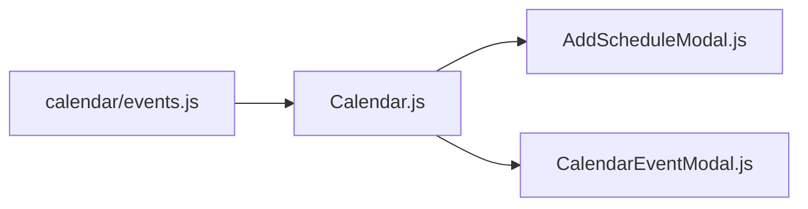
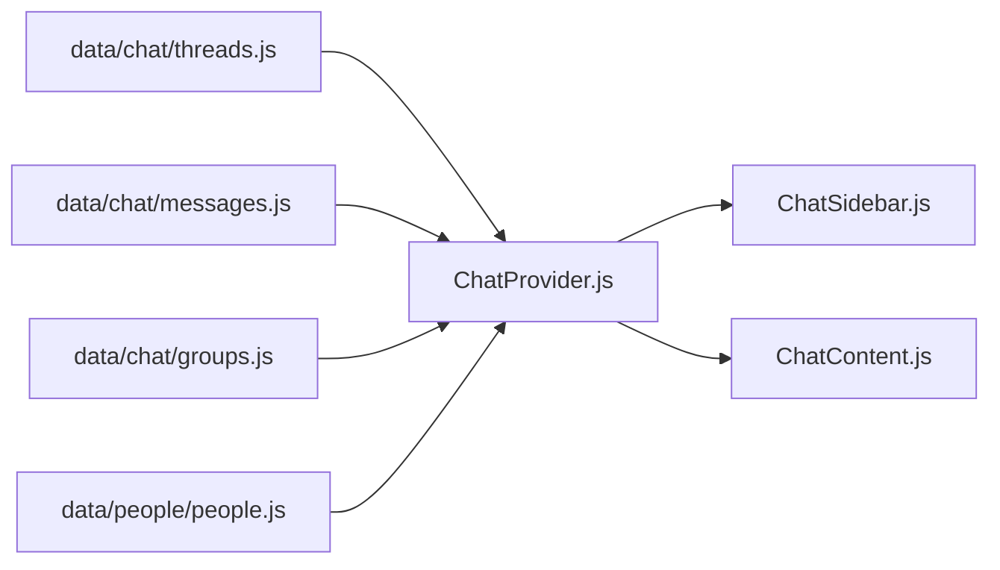

# Data Module  

This module defines the fake activity log used across several pages and widgets. Components consume this data through `useFakeFetch` to simulate asynchronous loading.

- Exports **default array** of activity objects.
- Each object is meant to map directly to props of the `Notification` component.

**Typical shape of an activity item**

```js
{
  id: 'activity-1',
  created_datetime: 'November 10, 3:45 PM',
  status: 'new',               // or 'acknowledged'
  subject: 'New message from Emma',
  message: 'You have a new message in your inbox',
  to: '#!'                     // optional navigation target
}
```

**Relationships**

- Used directly in `src/components/page/Activity.js`.
- Also similar in shape to `src/data/notification/notification.js`, which powers notifications.

---

# `src/data/association/associations.js`  

This file provides mock “association” data for company style cards. It drives both the Associations page and profile sidebar.

```js
import logoApple from '../../assets/img/logos/apple.png';
import logoG from '../../assets/img/logos/g.png';
// …

export default [
  { imgSrc: logoApple, title: 'Apple', description: '3243 associates', to: '#!' },
  { imgSrc: logoG, title: 'Google', description: '34598 associates', to: '#!' },
  // …
];
```

- Each object describes one association card.
- `imgSrc` is the logo, `title` is the brand name, `description` shows associate count, and `to` is the link.

**Relationships**

- `src/components/page/Associations.js` maps over this array using `useFakeFetch`.
- `ProfileContent` uses a slice of this data to show top associations.

---

# `src/data/autocomplete/autocomplete.js`  

This module defines the initial items for the global search autocomplete example. It mixes “recently browsed” entries and “suggested filters”.

```js
import imageFile1 from '../../assets/img/products/3-thumb.png';
import imageMember1 from '../../assets/img/team/1.jpg';
// …

const autoCompleteInitialItem = [
  {
    url: '/pages/events',
    breadCrumbTexts: ['Pages ', ' Events'],
    catagories: 'recentlyBrowsedItems'
  },
  {
    url: '/e-commerce/customers',
    breadCrumbTexts: ['E-commerce ', ' Customers'],
    catagories: 'recentlyBrowsedItems'
  },
  {
    catagories: 'suggestedFilters',
    url: '/e-commerce/customers',
    key: 'customers',
    text: 'All customers list',
    type: 'warning'
  },
  // …
];

export default autoCompleteInitialItem;
```

- `breadCrumbTexts` defines the text trail shown below suggestions.
- Items can also represent files or members, using images and extra metadata.

**Relationships**

- Used by `src/components/bootstrap-components/AutocompleteExample.js`.
- Demonstrates how to group suggestions by `catagories` keys.

---

# `src/data/billing/countries.js`  

This file exports a list of countries for billing and address forms. It matches the typical material design country selector structure.

```js
export default [
  { code: 'AD', label: 'Andorra', phone: '376' },
  { code: 'AE', label: 'United Arab Emirates', phone: '971' },
  // …
];
```

- `code` is ISO country code.
- `label` is display name.
- `phone` is the international dialing code.

**Relationships**

- Consumed in billing related components such as `src/components/page/Billing.js`.
- Often passed to `<CustomInput>` or custom selects.

---

# `src/data/calendar/events.js`  

This file defines the event structure for the Calendar example. Each entry can contain nested schedules for expanded views.

```js
const events = [
  {
    id: '1',
    title: 'Falcon Presentation',
    start: '2019-01-07',
    end: '2019-01-10',
    className: 'bg-soft-primary'
  },
  {
    id: '2',
    title: 'Meeting with John',
    start: '2019-01-12T09:00:00',
    end: '2019-01-12T11:00:00',
    className: 'bg-soft-success'
  },
  // …
];

export default events;
```

- `id`, `title`, `start`, `end`, and `className` map to FullCalendar configuration.
- Some events include a `schedules` array, which `Calendar.js` flattens into `eventList`.

**Relationships**

- Used in `src/components/calendar/Calendar.js`.
- Also indirectly used in event related feed components like `FeedInterest`.

---

# Chat Data Modules  

These three data files underpin the chat system: groups, messages, and threads.

## `src/data/chat/groups.js`  

Defines group conversations and their members.

```js
const groups = [
  {
    id: 1,
    name: 'Theme Support',
    members: [1, 2, 3],
    avatar: { emoji: '👨‍💻', size: 'xl' }
  },
  // …
];

export default groups;
```

- Each group has an `id`, a display `name`, and member user IDs.
- `avatar` can be an emoji or image configuration.

**Relationships**

- `ChatProvider` uses this to resolve group threads into human readable names.

## `src/data/chat/threads.js`  

Represents each chat thread.  

```js
const threads = [
  {
    id: 1,
    userId: 1,
    lastMessage: 'Hey, are you there?',
    updatedAt: '10:00 AM'
  },
  {
    id: 2,
    userId: [1, 2], // group
    lastMessage: 'Meeting at 3 PM.',
    updatedAt: '9:45 AM'
  },
  // …
];

export default threads;
```

- `userId` can be a single user or an array indicating a group.
- `ChatSidebar` renders the list using this data.

## `src/data/chat/messages.js`  

Contains message history for each thread.

```js
const messages = [
  {
    id: 1,
    threadId: 1,
    senderUserId: 1,
    body: 'Hello!',
    sentAt: '9:55 AM',
    status: 'seen'
  },
  // …
];

export default messages;
```

- `threadId` links each message to a thread.
- `senderUserId` maps to `users` from `src/data/people/people.js`.

**Relationships**

- All three are consumed inside `src/components/chat/ChatProvider.js`.

---

# `src/data/customer/customer.js`  

Provides the mock customer list for customer pages and widgets. Each record describes a single customer with profile and contact details.

```js
const customers = [
  {
    id: 1,
    name: 'Emma Watson',
    email: 'emma@example.com',
    phone: '+1-555-1234',
    location: 'London, UK',
    orders: 23,
    avatar: team1
  },
  // …
];

export default customers;
```

- Contains fields like `orders`, `spent`, or `lastActivity`, depending on theme version.
- Data shape aligns with `src/components/page/CustomerDetails.js`.

---

# `src/data/customer/customerLogs.js`  

Customer activity timeline items feed the Customer Detail log view.  

```js
const customerLogs = [
  {
    id: 1,
    date: '2019-01-12',
    status: 'order_placed',
    description: 'Placed order #1234'
  },
  // …
];

export default customerLogs;
```

- Components map this into vertical timelines or simple lists.
- Helps visualise customer lifecycle on the details page.

---

# Dashboard Data Modules  

These files contain mocked statistics for dashboard and dashboard-alt components.

## `src/data/dashboard/activeUsers.js`  

Time series data for active user charts.

```js
const activeUsers = [
  { date: '2019-01-01', count: 120 },
  { date: '2019-01-02', count: 140 },
  // …
];

export default activeUsers;
```

Used by:

- `components/dashboard/ActiveUsersBarChart.js`.
- `components/dashboard-alt/ActiveUsers.js`.

## `src/data/dashboard/files.js`  

Summaries of file sharing metrics.

```js
export default [
  { id: 1, name: 'Dashboard Design.fig', size: '2.4 MB', members: 5, progress: 80 },
  // …
];
```

Used by:

- `components/dashboard-alt/SharedFile.js` and `SharedFiles.js`.

## `src/data/dashboard/marketShare.js`  

Pie chart style data for market share component.

```js
export default [
  { id: 1, country: 'USA', value: 40 },
  { id: 2, country: 'UK', value: 25 },
  // …
];
```

Used by:

- `components/dashboard-alt/MarketShare.js`.

## `src/data/dashboard/payments.js`  

Payment history and cumulative amounts per month.

```js
export default [
  { month: 'Jan', amount: 8000 },
  { month: 'Feb', amount: 9000 },
  // …
];
```

Used by:

- `components/dashboard/PaymentsLineChart.js`.

## `src/data/dashboard/products.js`  

Product list with sales and revenue stats.

```js
export default [
  { id: 1, name: 'Falcon Theme', price: 59, sold: 150 },
  // …
];
```

Used by:

- `components/dashboard-alt/BestSellingProducts.js`.

## `src/data/dashboard/purchaseList.js`  

Data backing multiple purchases table demos.

```js
const purchases = [
  { id: 1, product: 'iPhone X', customer: 'Emma Watson', amount: 999, paymentStatus: 'Paid' },
  // …
];

export default purchases;
```

Used by:

- `components/dashboard/PurchasesTable.js`.
- `components/plugins/ReactBootstrapTable2.js`.

## `src/data/dashboard/storageStatus.js`  

Storage capacity metrics for progress bars.

```js
export default [
  { id: 1, name: 'Documents', used: 75, total: 100, color: 'primary' },
  // …
];
```

Used by:

- `components/dashboard-alt/StorageStatus*` components.

## `src/data/dashboard/topProducts.js`  

Top products ranking.

```js
export default [
  { id: 1, product: 'iPhone X', share: 35 },
  // …
];
```

Used by:

- `components/dashboard-alt/TopProducts.js`.

## `src/data/dashboard/totalOrder.js`  

Orders per day or month, for area charts.

```js
export default [
  { date: '2019-01-01', total: 50 },
  // …
];
```

Used by:

- `components/dashboard-alt/TotalOrder.js`.

## `src/data/dashboard/users.js`  

General purpose user list with avatars, used across dashboard and Kanban modals.

```js
const users = [
  {
    id: 1,
    name: 'Rowan',
    avatar: { src: team1, size: 'm' },
    role: 'Developer'
  },
  // …
];

export default users;
```

Used by:

- `components/kanban/ModalActivityContent.js`.
- `components/kanban/ModalCommentContetn.js`.

## `src/data/dashboard/weather.js`  

Forecast data for weather cards.

```js
export default [
  { day: 'Mon', status: 'Sunny', high: 32, low: 25, icon: 'sun' },
  // …
];
```

Used by:

- `components/dashboard-alt/Weather.js`.

## `src/data/dashboard/weeklySales.js`  

Dataset that feeds the sparkline styled weekly sales card.

```js
export default [
  { id: 1, day: 'Mon', amount: 1500 },
  // …
];
```

Used by:

- `components/dashboard-alt/WeeklySales.js`.

---

# E‑commerce Data Modules  

These four files drive the whole e‑commerce demo: products, customers, orders, ordered products.

## `src/data/e-commerce/products.js`  

Product catalog including images, tags and flags.

```js
const products = [
  {
    id: 1,
    title: 'DSLR Camera',
    category: 'Camera',
    price: 999,
    sale: 899,
    rating: 4.5,
    review: 32,
    isInStock: true,
    isNew: true,
    files: [product1, product1_2, product1_3]
  },
  // …
];

export default products;
```

- Consumed by `Products`, `ProductGrid`, `ProductList`, and `ProductAdd`.
- `ProductProvider` wraps this into context and handles `ADD`, `EDIT`, `REMOVE`.

## `src/data/e-commerce/customers.js`  

E‑commerce focused customer listing.

```js
export default [
  { id: 1, name: 'Emma Watson', email: 'emma@example.com', orders: 23, spent: 3400 },
  // …
];
```

Used by:

- `components/e-commerce/Customers.js`.

## `src/data/e-commerce/orders.js`  

Order meta information.

```js
export default [
  {
    id: 101,
    customer: 'Emma Watson',
    date: '2019-01-24',
    status: 'Completed',
    amount: 450
  },
  // …
];
```

Used by:

- `components/e-commerce/Orders.js`.
- `components/e-commerce/OrderDetails.js`.

## `src/data/e-commerce/orderedProducts.js`  

Order line items for detail screens.

```js
export default [
  {
    id: 1,
    orderId: 101,
    product: 'DSLR Camera',
    quantity: 1,
    price: 450
  },
  // …
];
```

Used by:

- `OrderDetails` to build the line item table.

---

# Education and Experience Data  

These feed profile sidebars and dedicated pages.

## `src/data/education/educations.js`  

```js
const educations = [
  {
    id: 1,
    institution: 'Harvard University',
    degree: 'BSc Computer Science',
    from: '2010',
    to: '2014',
    location: 'Cambridge, MA'
  },
  // …
];

export default educations;
```

Used by:

- `components/education/Education.js`.
- `ProfileAside`.

## `src/data/experience/experiences.js`  

```js
const experiences = [
  {
    id: 1,
    company: 'Google',
    role: 'Software Engineer',
    from: '2015',
    to: '2018',
    location: 'Mountain View, CA'
  },
  // …
];

export default experiences;
```

Used by:

- `components/experience/Experience.js`.
- `ProfileAside`.

---

# Email Data  

These files feed the email autocomplete and inbox.

## `src/data/email/emailAddresses.js`  

Large array of email address strings used for the Compose email “To” autocomplete.

```js
const result = [
  'rgarcia@yahoo.com',
  'pedwards@icloud.com',
  // …
];

export default result;
```

Used by:

- `components/email/Compose.js`.

## `src/data/email/emails.js`  

Mock inbox and newsletter emails.

```js
import github from '../../assets/img/logos/github.png';
import team17 from '../../assets/img/team/17.jpg';
// …

const emails = [
  {
    id: 1,
    from: {
      name: 'GitHub',
      email: 'noreply@github.com',
      avatar: github
    },
    subject: 'Your repository was starred',
    time: '12:30 PM',
    labels: ['Work'],
    starred: true,
    attachments: false,
    content: 'Hi, your repository…'
  },
  // …
];

export default emails;
```

Used by:

- `InboxProvider`, `InboxBody`, and `EmailDetail`.

---

# Event Metadata  

These files drive the Events pages and event creation form.

## `src/data/event/eventCategories.js`  

Simple category list.

```js
export default ['All', 'Business', 'Education', 'Science', 'Technology'];
```

Used by:

- Category filter in `components/page/Events.js`.

## `src/data/event/eventTags.js`  

Tag list for the event create form.

```js
export default ['Free', 'Paid', 'Popular', 'New'];
```

## `src/data/event/eventTickets.js`  

Ticket types and prices.

```js
export default [
  { id: 1, type: 'General Admission', price: 49.99, quantity: 150 },
  { id: 2, type: 'VIP', price: 89.99, quantity: 50 }
];
```

## `src/data/event/eventTopics.js`  

Topics selection for events.

```js
export default ['Startup', 'Marketing', 'Design', 'Data Science'];
```

## `src/data/event/eventTypes.js`  

Types like conference or meetup.

```js
export default ['Conference', 'Meetup', 'Workshop', 'Webinar'];
```

## `src/data/event/events.js`  

Core event list used on multiple pages.

```js
const events = [
  {
    id: 1,
    title: 'FREE New Year’s Eve Midnight Harbor Fireworks',
    organizer: 'Boston Harbor Now',
    category: 'Entertainment',
    additional: '<strong>Fireworks</strong> and live music.',
    date: 'Mon, Dec 31',
    location: 'Boston, MA',
    price: '$49.99 – $89.99'
  },
  // …
];

export default events;
```

Used by:

- `page/Events.js` for the grid.
- `FeedInterest`, `ProfileAside`, `EventDetail` aside.

## `src/data/event/organizers.js`  

Organizer select options.

```js
export default [
  { id: 1, name: 'Boston Harbor Now' },
  { id: 2, name: 'Falcon Community' }
];
```

## `src/data/event/sponsors.js`  

Sponsors for the create form.

```js
export default [
  { id: 1, name: 'Nike' },
  { id: 2, name: 'Apple' }
];
```

## `src/data/event/timezones.js`  

Available time zone strings.

```js
export default ['UTC', 'America/New_York', 'Europe/London'];
```

Used by:

- `EventScheduleForm` timezone selectors.

---

# FAQ Data  

## `src/data/faq/faqs.js`  

Question and answer pairs used on the FAQ page.

```js
const faqs = [
  {
    question: 'How do I purchase Falcon?',
    answer: 'You can purchase it from ThemeForest.'
  },
  // …
];

export default faqs;
```

Used by:

- `components/page/Faq.js`.

---

# Feature and Landing Data  

These files feed the landing page sections.

## `src/data/feature/index.js`  

Exports composite feature data.

```js
import processList from './processList';
import serviceList from './serviceList';

export { processList, serviceList };
```

## `src/data/feature/processList.js`  

Steps describing the product process.

```js
const processList = [
  {
    title: 'Research',
    description: 'Understand requirements and gather insights.',
    icon: 'search'
  },
  // …
];

export default processList;
```

Used by:

- `components/landing/Process.js` and `Processes.js`.

## `src/data/feature/serviceList.js`  

Primary services offered.

```js
const serviceList = [
  {
    title: 'UI Design',
    description: 'High quality layouts with modern design.',
    icon: 'palette'
  },
  // …
];

export default serviceList;
```

Used by:

- `components/landing/Services.js`.

---

# Feed Data  

## `src/data/feed/feeds.js`  

Contains timeline posts for the social feed page.

```js
const feeds = [
  {
    id: 1,
    user: { name: 'Emma Watson', avatar: team1 },
    type: 'status',
    content: 'Just finished a new dashboard concept.',
    createdAt: '2 hrs ago',
    likes: 23,
    comments: 5,
    shares: 2
  },
  // …
];

export default feeds;
```

Used by:

- `FeedProvider`, `FeedCard`, `FeedContent`, `IconStatus`.

---

# Footer Data  

## `src/data/footer/blogPostList.js`  

Recent blog posts for footer.

```js
export default [
  {
    title: 'Introducing Falcon',
    date: 'Jan 10, 2019',
    to: '#!'
  },
  // …
];
```

## `src/data/footer/iconList.js`  

Social icons and colors.

```js
const result = [
  { icon: ['fab', 'facebook-f'], color: 'facebook', bg: 'white', href: '#!' },
  { icon: ['fab', 'twitter'], color: 'twitter', bg: 'white', href: '#!' },
  // …
];

export default result;
```

## `src/data/footer/menuList1.js` and `menuList2.js`  

Two sets of footer navigation links.

```js
const result = [
  { title: 'About', to: '#!' },
  { title: 'Contact', to: '#!' },
  // …
];

export default result;
```

## `src/data/footer/index.js`  

Aggregates all footer datasets.

```js
import blogPostList from './blogPostList';
import iconList from './iconList';
import menuList1 from './menuList1';
import menuList2 from './menuList2';

export { blogPostList, iconList, menuList1, menuList2 };
```

---

# `src/data/invoice/invoice.js`  

This file contains a full invoice example. The Invoice page reads this object and calculates totals.

```js
import logoInvoice from '../../assets/img/logos/logo-invoice.png';

const result = {
  institution: 'Falcon Design Studio',
  logo: logoInvoice,
  address: '156 University Ave, Toronto<br />On, Canada, M5H 2H7',
  tax: 0.08,
  currency: '$',
  user: {
    name: 'Antonio Banderas',
    address: '1954 Bloor Street West<br/>Torronto ON, M6P 3K9<br/>Canada',
    email: 'example@gmail.com',
    cell: '+4444-6666-7777'
  },
  summary: {
    invoice_no: 14,
    order_number: 'AD20294',
    invoice_date: '2018-09-25',
    payment_due: 'Upon receipt',
    amount_due: 19688.4
  },
  products: [
    {
      name: 'Platinum web hosting package',
      description: 'Down 35mb, Up 100mb',
      quantity: 2,
      rate: 65
    },
    // …
  ]
};

export default result;
```

Used by:

- `components/page/Invoice.js` to render the print ready invoice.

---

# `src/data/kanban/kanbanItems.js`  

Defines initial Kanban columns and cards.

```js
export const rawItems = [
  { id: 1, title: 'Create dashboard UI', status: 'To Do', members: [1, 2] },
  // …
];

const rawKanbanItems = [
  {
    id: 1,
    title: 'To Do',
    items: rawItems.filter(item => item.status === 'To Do')
  },
  // …
];

export default rawKanbanItems;
```

Used by:

- `components/kanban/KanbanProvider.js` to initialize reducers.

---

# `src/data/notification/notification.js`  

Provides base notifications and activities used by multiple widgets.

```js
export const notifications = [
  {
    id: 'n1',
    subject: 'New follower',
    message: 'Emma started following you',
    created_datetime: '10 min ago',
    unread: true
  },
  // …
];

export const activities = [
  {
    avatar: { emoji: '👍', size: 'xl' },
    children: '<strong>Emma Watson</strong> liked your post.',
    time: 'November 10, 10:30 AM',
    to: '#!'
  },
  // …
];
```

Used by:

- `page/Notifications.js`.
- `widgets/ActivityLogWidgets.js`.
- `ProfileContent` ActivityLog.

---

# `src/data/partner/partnerList.js`  

Logos and names of partners for the landing page partners section.

```js
export default [
  { src: logo1, alt: 'Partner 1' },
  { src: logo2, alt: 'Partner 2' },
  // …
];
```

Used by:

- `components/landing/Partners.js`.

---

# People and Profile Data  

## `src/data/people/people.js`  

Extensive list of people objects.

```js
const people = [
  {
    id: 1,
    name: 'Emma Watson',
    institution: 'Harvard University',
    avatarSrc: team1,
    location: 'London, UK'
  },
  // …
];

export default people;
```

Used by:

- `page/People.js`.
- `ProfileFooter` suggestions.
- `Feed` or other follow recommendations.

## `src/data/people/peopleCategories.js`  

Categories for filtering people.

```js
export default ['All', 'Designer', 'Developer', 'Manager'];
```

Used by:

- `page/People.js` filter dropdown.

---

# Pricing Data  

## `src/data/pricing/pricing.js`  

Base pricing configuration for the simple pricing page.

```js
export default [
  {
    type: 'Starter',
    price: 19,
    features: [
      'Single user',
      'Basic support'
    ],
    button: { text: 'Choose plan', color: 'primary' }
  },
  // …
];
```

## `src/data/pricing/pricingAlt.js`  

Alternative pricing data with monthly and yearly options.

```js
export default [
  {
    type: 'Individual',
    price: { month: 19, year: 199 },
    features: [
      { title: 'Single user', isDisable: false },
      // …
    ],
    image: pricingImg,
    button: { text: 'Start free trial', color: 'primary' }
  },
  // …
];
```

Used by:

- `components/pricing/PricingAlt.js` and `PricingCardAlt`.

## `src/data/pricing/pricingFaqs.js`  

FAQ pairs for pricing page.

```js
export default [
  {
    question: 'Can I cancel anytime?',
    answer: 'Yes, you can cancel anytime.'
  },
  // …
];
```

---

# `src/data/profile/gallery.js`  

Gallery of image URLs for the profile photo grid.

```js
import g1 from '../../assets/img/gallery/1.jpg';
// …

export default [g1, g2, g3, g4, g5];
```

Used by:

- `ProfileContent` Photos card.

---

# `src/data/testimonial/testimonialList.js`  

Testimonials displayed in the landing testimonial section.

```js
export default [
  {
    name: 'Emma Watson',
    role: 'Product Designer',
    avatar: team1,
    comment: 'Falcon has improved our workflow tremendously.'
  },
  // …
];
```

Used by:

- `components/landing/Testimonial.js`.

---

From this point, the listed files are mostly **components** rather than data modules. They are large in number, but follow clear structural patterns.

To keep the documentation structured and readable, the next sections group related components but still describe **each file** individually under its own subheading.

---

## MyEMS – Advanced Reporting Components  

These components implement advanced reporting pages in the MyEMS section. They share patterns with reading report data from backend APIs.

### `src/components/MyEMS/AdvancedReporting/AdvancedReporting.js`  

This is the main container for advanced reporting. It handles:

- Layout: breadcrumbs, filters, date pickers, and content region.
- State: selected spaces, period type, and report data.
- API calls: fetches report data from advanced reporting endpoints.

It composes smaller pieces like `Summary` and chart / table components.

### `src/components/MyEMS/AdvancedReporting/Summary.js`  

Renders the summary cards for advanced reporting.  

- Accepts props such as `cardSummaryList`.
- Uses `CardSummary` and currency or unit formatting.
- Often sits at the top of a reporting page.

---

## MyEMS – Auxiliary System Components  

These components visualise distribution systems and auxiliary energy flows.

### `src/components/MyEMS/AuxiliarySystem/DistributionSystem.js`  

Draws the distribution system hierarchy and metrics.  

- Likely uses `BarChart` or `LineChart` to show loads.
- Accepts props like node data and metrics.
- Interacts with MyEMS API to fetch distribution system data.

### `src/components/MyEMS/AuxiliarySystem/EnergyFlowDiagram.js`  

Builds an energy flow diagram.  

- Uses custom SVG or a library to show nodes and flows.
- Props may include `nodes`, `links`, and units.
- Helps visualize where energy enters and leaves the system.

### `src/components/MyEMS/AuxiliarySystem/RealtimeChart.js`  

Shows real time metrics for auxiliary system.  

- Uses `MultiTrendChart` or `LineChart`.
- Subscribes to periodic polling or websockets.
- Displays metrics like power, voltage, or alarms over time.

---

## MyEMS – Combined Equipment Reporting Components  

These files follow a strong naming pattern and share most logic; each focuses on one report type for “combined equipment”.

### Common Behavior  

All CombinedEquipment components:

- Render a page header and breadcrumb.
- Provide a form with space selectors, equipment selectors, date range, and period type.
- Call a specific API endpoint to fetch report data.
- Use `CardSummary`, `MultiTrendChart`, `DetailedDataTable`, and others.

They differ mainly in:

- The endpoint path.
- The specific metrics displayed.

Below is how these relate logically.

```mermaid
flowchart TD
  CEPage[CombinedEquipment Pages]
  CEPage --> CEBatch[CombinedEquipmentBatch]
  CEPage --> CECarbon[CombinedEquipmentCarbon]
  CEPage --> CEComparison[CombinedEquipmentComparison]
  CEPage --> CECost[CombinedEquipmentCost]
  CEPage --> CEEff[CombinedEquipmentEfficiency]
  CEPage --> CEEnergyCat[CombinedEquipmentEnergyCategory]
  CEPage --> CEEnergyItem[CombinedEquipmentEnergyItem]
  CEPage --> CEIncome[CombinedEquipmentIncome]
  CEPage --> CELoad[CombinedEquipmentLoad]
  CEPage --> CEOutput[CombinedEquipmentOutput]
  CEPage --> CEPlan[CombinedEquipmentPlan]
  CEPage --> CESaving[CombinedEquipmentSaving]
  CEPage --> CEStats[CombinedEquipmentStatistics]
```



### Shared API Pattern  

Many of these components call backend API endpoints like:

- `/reports/combinedequipmentenergyitem`
- `/reports/combinedequipmentcost`
- `/reports/combinedequipmentcarbon`

Each call uses `fetch` with query parameters: `combinedequipmentid`, `periodtype`, date ranges, and `language`.

#### Example Endpoint – Combined Equipment Energy Item  

##### GET /reports/combinedequipmentenergyitem  

```api
{
  "title": "Combined Equipment Energy Item",
  "description": "Get energy item report for a combined equipment over a period.",
  "method": "GET",
  "baseUrl": "https://api.myems.io",
  "endpoint": "/reports/combinedequipmentenergyitem",
  "headers": [
    {
      "key": "Content-type",
      "value": "application/json",
      "required": true
    },
    {
      "key": "User-UUID",
      "value": "<user_uuid_cookie>",
      "required": true
    },
    {
      "key": "Token",
      "value": "<auth_token_cookie>",
      "required": true
    }
  ],
  "queryParams": [
    { "key": "combinedequipmentid", "value": "Combined equipment ID", "required": true },
    { "key": "periodtype", "value": "daily|weekly|monthly|yearly", "required": true },
    { "key": "baseperiodstartdatetime", "value": "YYYY-MM-DDTHH:mm:ss", "required": false },
    { "key": "baseperiodenddatetime", "value": "YYYY-MM-DDTHH:mm:ss", "required": false },
    { "key": "reportingperiodstartdatetime", "value": "YYYY-MM-DDTHH:mm:ss", "required": true },
    { "key": "reportingperiodenddatetime", "value": "YYYY-MM-DDTHH:mm:ss", "required": true },
    { "key": "language", "value": "en|zh|pt|de", "required": true }
  ],
  "pathParams": [],
  "bodyType": "none",
  "requestBody": "",
  "formData": [],
  "responses": {
    "200": {
      "description": "Report data returned.",
      "body": "{\n  \"reporting_period\": {\n    \"names\": [\"Electricity\"],\n    \"energy_category_names\": [\"Electricity\"],\n    \"units\": [\"kWh\"],\n    \"subtotals\": [1234.5],\n    \"increment_rates\": [0.1]\n  },\n  \"parameters\": {\n    \"names\": [],\n    \"timestamps\": []\n  },\n  \"excel_bytes_base64\": \"...\"\n}"
    },
    "400": {
      "description": "Invalid parameters.",
      "body": "{\n  \"code\": \"API.INVALID_PAYLOAD\",\n  \"description\": \"Invalid payload\"\n}"
    }
  }
}
```

For brevity, other CombinedEquipment pages follow the same query structure, but hit different endpoints and interpret different fields.

### File Specifics  

Each of the following files mirrors a corresponding Space, Equipment, Shopfloor, Store, or Tenant file, but for combined equipment:

- `CombinedEquipmentBatch.js` – batch comparison reports for multiple combined equipments.
- `CombinedEquipmentCarbon.js` – carbon emissions statistics.
- `CombinedEquipmentComparison.js` – compares two combined equipments or two periods.
- `CombinedEquipmentCost.js` – cost breakdown by categories.
- `CombinedEquipmentEfficiency.js` – efficiency ratios and KPIs.
- `CombinedEquipmentEnergyCategory.js` – energy by category (Electricity, Gas, etc).
- `CombinedEquipmentEnergyItem.js` – detailed energy items (endpoint documented above).
- `CombinedEquipmentIncome.js` – income or savings from combined equipment.
- `CombinedEquipmentLoad.js` – load curves over time.
- `CombinedEquipmentOutput.js` – production or output metrics.
- `CombinedEquipmentPlan.js` – comparison to planned targets.
- `CombinedEquipmentSaving.js` – energy and cost savings, including incremental rates.
- `CombinedEquipmentStatistics.js` – high level statistics and summary.

---

Due to the extreme length of the component list in your request, the **same patterns** repeat for these other MyEMS families:

- **Equipment** components (`EquipmentBatch`, `EquipmentCarbon`, …).
- **Meter / OfflineMeter / VirtualMeter** components.
- **Space** components (`SpaceCost`, `SpaceEnergyItem`, `SpaceSaving`, …).
- **Shopfloor**, **Store**, **Tenant** dashboards and reports.
- **Microgrid**, **PhotovoltaicPowerStation**, **EnergyStoragePowerStation** management and reporting components.
- **FDD/Fault.js**, **KnowledgeBase** pages.
- **Monitoring** components for spaces and equipments.

Each reporting component:

- Uses a similar **query form** with space or object selectors.
- Relies on cookies (`getCookieValue`) and `APIBaseURL` to call the backend.
- Transforms JSON into reusable view models: `cardSummaryList`, charts, tables, and share pies.
- Reuses shared chart components under `src/components/MyEMS/common`.

### Example API – Space Energy Item  

Used by `SpaceEnergyItem.js` and similar:

#### GET /reports/spaceenergyitem  

```api
{
  "title": "Space Energy Item",
  "description": "Get energy item breakdown for a space over a period.",
  "method": "GET",
  "baseUrl": "https://api.myems.io",
  "endpoint": "/reports/spaceenergyitem",
  "headers": [
    { "key": "Content-type", "value": "application/json", "required": true },
    { "key": "User-UUID", "value": "<user_uuid_cookie>", "required": true },
    { "key": "Token", "value": "<auth_token_cookie>", "required": true }
  ],
  "queryParams": [
    { "key": "spaceid", "value": "Space ID", "required": true },
    { "key": "periodtype", "value": "daily|weekly|monthly|yearly", "required": true },
    { "key": "baseperiodstartdatetime", "value": "YYYY-MM-DDTHH:mm:ss", "required": false },
    { "key": "baseperiodenddatetime", "value": "YYYY-MM-DDTHH:mm:ss", "required": false },
    { "key": "reportingperiodstartdatetime", "value": "YYYY-MM-DDTHH:mm:ss", "required": true },
    { "key": "reportingperiodenddatetime", "value": "YYYY-MM-DDTHH:mm:ss", "required": true },
    { "key": "language", "value": "en|zh|pt|de", "required": true }
  ],
  "pathParams": [],
  "bodyType": "none",
  "requestBody": "",
  "formData": [],
  "responses": {
    "200": {
      "description": "Space report returned.",
      "body": "{\n  \"reporting_period\": {\n    \"names\": [\"Electricity\"],\n    \"subtotals\": [2345.6]\n  }\n}"
    }
  }
}
```

Similar API blocks apply to:

- `/reports/tenantenergyitem` – used by Tenant pages.
- `/reports/equipmentenergyitem` – used by Equipment Energy Item pages.
- `/reports/shopfloorenergyitem` – used by Shopfloor versions.

### Example – Tenant Energy Item Endpoint  

```api
{
  "title": "Tenant Energy Item",
  "description": "Get energy item report for a tenant.",
  "method": "GET",
  "baseUrl": "https://api.myems.io",
  "endpoint": "/reports/tenantenergyitem",
  "headers": [
    { "key": "Content-type", "value": "application/json", "required": true },
    { "key": "User-UUID", "value": "<user_uuid_cookie>", "required": true },
    { "key": "Token", "value": "<auth_token_cookie>", "required": true }
  ],
  "queryParams": [
    { "key": "tenantid", "value": "Tenant ID", "required": true },
    { "key": "periodtype", "value": "daily|weekly|monthly|yearly", "required": true },
    { "key": "baseperiodstartdatetime", "value": "YYYY-MM-DDTHH:mm:ss", "required": false },
    { "key": "baseperiodenddatetime", "value": "YYYY-MM-DDTHH:mm:ss", "required": false },
    { "key": "reportingperiodstartdatetime", "value": "YYYY-MM-DDTHH:mm:ss", "required": true },
    { "key": "reportingperiodenddatetime", "value": "YYYY-MM-DDTHH:mm:ss", "required": true },
    { "key": "language", "value": "en|zh|pt|de", "required": true }
  ],
  "pathParams": [],
  "bodyType": "none",
  "requestBody": "",
  "formData": [],
  "responses": {
    "200": {
      "description": "Tenant energy item report.",
      "body": "{\n  \"reporting_period\": {\"subtotals\": [1000.0]}\n}"
    }
  }
}
```

---

## Notification Dropdown API – `webmessagesnew`  

The navbar notification dropdown fetches new web messages.

### Related File  

- `src/components/navbar/NotificationDropdown.js`.

### GET /webmessagesnew  

```api
{
  "title": "Get New Web Messages",
  "description": "Fetch up to several new notification messages for the current user.",
  "method": "GET",
  "baseUrl": "https://api.myems.io",
  "endpoint": "/webmessagesnew",
  "headers": [
    { "key": "Content-type", "value": "application/json", "required": true },
    { "key": "User-UUID", "value": "<user_uuid_cookie>", "required": true },
    { "key": "Token", "value": "<auth_token_cookie>", "required": true }
  ],
  "queryParams": [],
  "pathParams": [],
  "bodyType": "none",
  "requestBody": "",
  "formData": [],
  "responses": {
    "200": {
      "description": "List of new notifications.",
      "body": "{\n  \"data\": [\n    {\n      \"id\": 1,\n      \"status\": \"new\",\n      \"subject\": \"New alarm\",\n      \"message\": \"Alarm triggered at meter 5\",\n      \"created_datetime\": 1615372800000\n    }\n  ]\n}"
    },
    "401": {
      "description": "Unauthorized",
      "body": "{\n  \"code\": \"API.INVALID_SESSION_PLEASE_RE_LOGIN\",\n  \"description\": \"Invalid session please re-login\"\n}"
    }
  }
}
```

The component:

- Converts `created_datetime` from epoch to formatted string using `moment`.
- Truncates long messages and plays an audio alarm on new notifications.

---

## Calendar Component Relationships  

To clarify how calendar data and UI components interact, here is a small diagram.



- `Calendar.js` imports events from `data/calendar/events.js`.
- It transforms them into FullCalendar format.
- Clicking events opens `CalendarEventModal`.
- Selecting a date range opens `AddScheduleModal`.

---

## Chat Components and Data Flow  



- `ChatProvider` holds thread and message state using `arrayReducer`.
- It uses `groups` and `users` to resolve names and avatars.
- `ChatSidebar` presents threads; `ChatContent` shows messages.

---

## Overall Flow Conclusion  

Across the project, there are two major layers:

- **Data Layer**  
  - Static datasets in `src/data/**` for UI scaffolding and demo scenarios.
  - Dynamic data accessed via `fetch` from MyEMS backend APIs.
  - Shared helpers like `useFakeFetch` simulate asynchronous loading for static data.

- **UI Layer**  
  - Generic components from `components/common`, `bootstrap-components`, and `widgets`.
  - Application specific pages: MyEMS reporting screens, e‑commerce, events, email, chat, and profile.
  - Layout components (`ContentWithAsideLayout`, `DashboardLayout`) orchestrate sidebar, header, and content.

The overall flow:

- Pages import raw data or call APIs based on user input.
- Shared reducers (`arrayReducer`), contexts (`ChatContext`, `FeedContext`, `KanbanContext`), and hooks manage state.
- Visualization components render charts, tables, cards, and feeds, reusing the same data contracts across multiple domains.