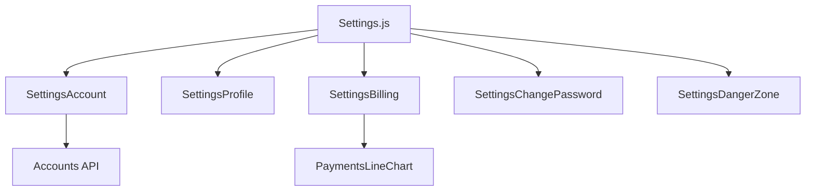
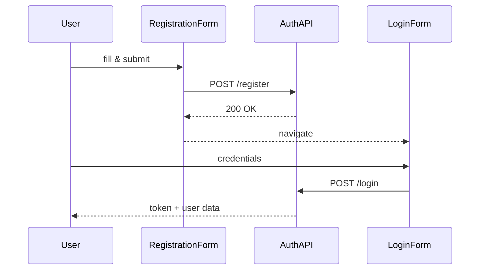
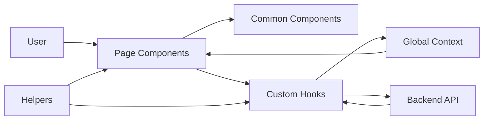
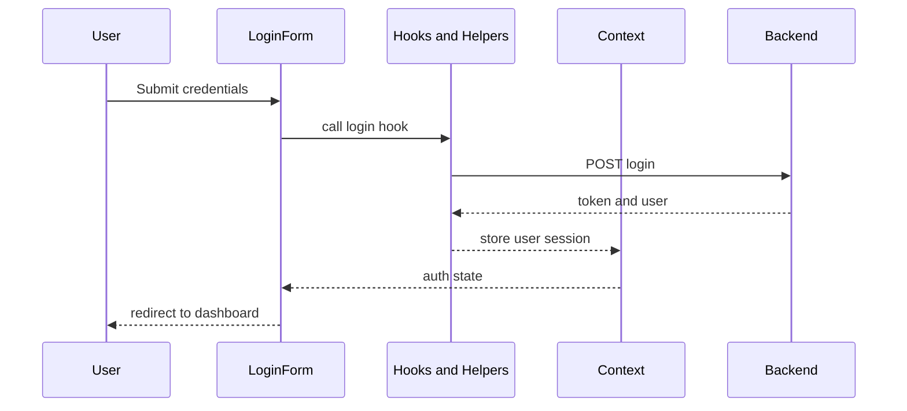
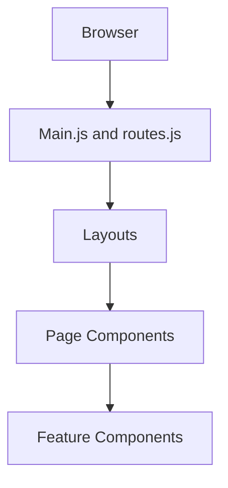

# Overall Documentation

## Assets  
The **assets** directory holds static resources such as Lottie animations and SCSS themes.

### src/assets/lottie/bellalert.json  
- **Purpose**: Defines a bell-ringing animation for notifications.  
- **Usage**: Rendered via the `Lottie` plugin (`src/components/plugins/Lottie.js`) in notification dropdowns.  
- **Format**: Standard Lottie JSON schema for vector animations.

### src/assets/lottie/mail.json  
- **Purpose**: Defines an envelope-mail animation for email interfaces.  
- **Usage**: Shown in components like `ConfirmMailContent` and `Inbox`.  
- **Format**: Lottie JSON, compatible with React wrappers.

---

## Styles  
SCSS files here define global design tokens and theme palettes.

### src/assets/scss/theme.scss  
- Declares **light-mode** color variables (primary, secondary, backgrounds).  
- Sets typography scales and spacing utilities.  
- Imported at app startup via the `toggleStylesheet` helper  

```scss
@import 'assets/scss/theme';
// Usage example
body {
  background-color: $background;
  color: $text-primary;
}
```

### src/assets/scss/theme-dark.scss  
- Overrides variables for **dark-mode** (dark backgrounds, light text).  
- Complements `theme.scss` with inverted contrast.  
- Dynamically loaded by `toggleStylesheet` when user toggles themes.

---

## Settings Components  
Components under **src/components/Settings** let users manage their account, profile, billing, and security.



### src/components/Settings/SettingsAccount.js  
- Renders form for **email** and **username** updates.  
- Uses `FalconInput` and `ButtonIconTooltip` from **common**.  
- Dispatches updates via user-context to `/api/account`.

### src/components/Settings/SettingsProfile.js  
- Allows editing of **avatar** and personal details.  
- Integrates `FalconLightBox` for image previews.  
- Submits via profile API; updates global `Context`.

### src/components/Settings/SettingsBilling.js  
- Shows billing info, payment history, invoices.  
- Embeds `DashboardDepositStatus` and `CardSummary`.  
- Fetches data from `/api/billing` endpoints.

### src/components/Settings/SettingsChangePassword.js  
- Presents **current** and **new password** fields.  
- Validates strength and mismatch errors.  
- Calls `/auth/change-password` API on submit.

### src/components/Settings/SettingsDangerZone.js  
- Contains irreversible actions (account deletion).  
- Wraps actions in a red-themed `Modal` from **bootstrap-components**.  
- Warns users with alerts before performing critical calls.

---

## Association Component  
### src/components/association/Association.js  
- Fetches and lists user-group associations.  
- Renders each item as a `ListGroup.Item` (from **bootstrap-components**).  
- Links to detailed views (`Member.js`, `People.js`).

---

## Authentication Components  
These components implement the full auth flow: registration, login, password resets, and social logins.



### src/components/auth/ConfirmMailContent.js  
- Displays success message after signup.  
- Uses `mail.json` Lottie animation.  
- Provides link to **LoginForm**.

### src/components/auth/RegistrationForm.js  
- Handles new user signup.  
- Fields: name, email, password.  
- Integrates `SocialAuthButtons` for OAuth providers.

### src/components/auth/LoginForm.js  
- Standard email/password login form.  
- Validates input; shows errors via `Toast`.  
- On success, stores token in `Context` and redirects.

### src/components/auth/SocialAuthButtons.js  
- Renders OAuth buttons (Google, Facebook).  
- On click, opens external OAuth flows and handles callbacks.

### src/components/auth/ForgetPasswordForm.js  
- Collects email to initiate password reset.  
- Calls `/auth/forgot-password`.  
- Shows confirmation via `Alerts`.

### src/components/auth/PasswordResetForm.js  
- Reads reset **token** from URL.  
- Prompts new password entry.  
- Submits to `/auth/reset-password`.

### src/components/auth/LockScreenForm.js  
- Secures inactive sessions.  
- Prompts for current password to unlock.  
- Uses session token from `Context`.

### src/components/auth/LogoutContent.js  
- Asks for logout confirmation.  
- Clears tokens and redirects to `LoginForm`.

---

## Bootstrap Wrapper Components  
These files wrap [React-Bootstrap](https://react-bootstrap.github.io/) primitives to match our theme.

| Component                 | Description                                                 |
|---------------------------|-------------------------------------------------------------|
| Alerts.js                 | Stylized `<Alert>` with auto-dismiss                       |
| AutocompleteExample.js    | Demo for type-ahead input                                   |
| Avatar.js                 | User avatar with initials fallback                          |
| Backgrounds.js            | Utility classes for colored backgrounds                     |
| Badges.js                 | Badge variants with counts                                  |
| Breadcrumb.js             | `<Breadcrumb>` wrapper                                      |
| Buttons.js                | Standardized `<Button>` variants                            |
| Cards.js                  | Card layouts with header/footer slots                       |
| Carousel.js               | Image carousel wrapper                                      |
| Collapses.js              | `<Collapse>` panels                                         |
| Combo.js                  | Combined dropdown + input                                   |
| CookieAlert.js            | GDPR cookie consent alert                                   |
| CookieNotice.js           | Persistent cookie notification                              |
| Dropdowns.js              | Dropdown menus                                              |
| FalconAccordions.js       | Custom accordion UI                                         |
| Forms.js                  | Form grouping components                                    |
| ListGroups.js             | `<ListGroup>` items                                         |
| Modals.js                 | `<Modal>` with standard header/footer                       |
| NavBarTop.js              | Top navigation bar                                          |
| Navbars.js                | Sidebar & top nav variants                                  |
| Navs.js                   | Tab navigation                                              |
| PageHeaders.js            | Page title and subtitle block                               |
| Paginations.js            | Pagination controls                                         |
| Popovers.js               | `<Popover>` wrappers                                        |
| ProgressBar.js            | `<ProgressBar>` with label                                  |
| Sidepanel.js              | Off-canvas side panel                                       |
| Spinners.js               | Loading spinner components                                  |
| Tables.js                 | Table layouts                                               |
| Tabs.js                   | Tabbed content                                              |
| Tooltips.js               | `<Tooltip>` wrappers                                        |
| VerticalNavbar.js         | Vertical navigation menu                                    |

_All wrappers import Bootstrap components and apply our SCSS variables._

---

## Calendar Components  
These three files power the event calendar and scheduling modals.

- **AddScheduleModal.js**: Modal form to create/edit events.  
- **Calendar.js**: Main calendar view (day/week/month).  
- **CalendarEventModal.js**: Shows details and actions for a selected event.  

They fetch and post events via `/api/events` and emit callbacks to parent views.

---

## Changelog Components  
- **ChangeLog.js**: Displays a timeline of version changes.  
- **Logs.js**: Renders detailed log entries with filters.  
- **changeLogs.js**: Static data array of change entries.

_Used in `ChangeLog` page under `/changelog` routes._

---

## Chart Component  
- **Chart.js**: Generic wrapper around `react-chartjs-2`.  
- Accepts `data`, `options`, and `type` props.  
- Used by various dashboards: `ActiveUsersBarChart`, `PaymentsLineChart`, etc.

---

## Chat Components  
- **ChatProvider.js**: Supplies chat context and WebSocket connection.  
- **Chat.js**: Renders message list and input box; subscribes to context.

_Collaborates with `Context.js` for user identity and message dispatch._

---

## Common UI Components  
A suite of reusable UI pieces under **src/components/common**:

- **Avatar.js**, **Background.js**, **ButtonIcon.js**, **ButtonIconTooltip.js**  
- **Calendar.js**, **CodeHighlight.js**, **Debug.js**, **Divider.js**, **Dot.js**  
- **FalconCardHeader.js**, **FalconCardFooterLink.js**, **FalconDropzone.js**, **FalconEditor.js**, **FalconInput.js**  
- **FalconLightBox.js**, **FalconPlyr.js**, **FalconProgress.js**, **FalconProgressBar.js**  
- **Flex.js**, **FormGroupInput.js**, **FormGroupSelect.js**, **HighlightMedia.js**, **LightBoxGallery.js**  
- **Loader.js**, **PageHeader.js**, **QuantityController.js**, **QuillEditor.js**, **ScrollBarCustom.js**, **Section.js**, **Select.js**, **Toast.js**, **Verified.js**

_These components underpin pages and widgets across the app._

---

## Dashboard Components  
Key analytics and summary views in **src/components/dashboard**:

- **ActiveUsersBarChart.js**, **ActiveUsersMap.js**, **CardSummary.js**, **Dashboard.js**  
- **DashboardDepositStatus.js**, **LeafletMap.js**, **MarkerCluster.js**, **PaymentsLineChart.js**  
- **PurchasesTable.js**, **PurchasesTableActions.js**, **constants.js**

_Imports `Chart.js`, map utils, and calls `/api/dashboard` endpoints._

---

## Dashboard-Alt Components  
Alternate dashboard style in **src/components/dashboard-alt** (23 files), including:

- **DashboardAlt.js**, **ActiveUsers.js**, **BandwidthSaved.js**, **BestSellingProducts.js**, **MarketShare.js**, **StorageStatus.js**, **WeeklySales.js**, etc.

_They reuse `Chart.js` and data from the same APIs as the main dashboard._

---

## Documentation Component  
- **GettingStarted.js**: Onboarding guide for new developers.  
- Renders code samples via `CodeHighlight` and links to setup docs.

---

## E-commerce Components  
Under **src/components/e-commerce** (11 files):

- **Checkout.js**, **Customers.js**, **FavouriteItems.js**, **OrderDetails.js**, **Orders.js**, **Products.js**, **ShoppingCart.js**, plus provider and detail header.

_They interact with `/api/products` and `/api/orders`, and use common UI wrappers._

---

## Education Components  
- **Education.js**, **EducationForm.js**, **EducationInput.js**, **EducationSummary.js**  
- Support educational profiles or certifications.  

---

## Email Components  
- **Compose.js**, **ComposeAttachment.js**, **EmailDetail.js**, **EmailDetailHeader.js**, **Inbox.js**  
- Provide a mini email client experience.

---

## Error Pages  
- **Error404.js** and **Error500.js** render friendly error screens.

---

## Event Components  
Under **src/components/event** (9 files):

- **EventCreateBanner/Footer/Aside/Select.js**, **EventCustomField.js**, **EventDetailsForm.js**, **EventScheduleForm.js**, **EventSummary.js**, **EventTicket.js**

_Use common form and calendar components; call `/api/events`._

---

## Experience Components  
- **Experience.js**, **ExperienceForm.js**, **ExperienceInput.js**, **ExperienceSummary.js**  
- Manage user work or project experiences.

---

## Extra & Starter  
- **Pdf.js**: PDF viewer integration.  
- **Starter.js**: Boilerplate showcase page.

---

## FAQ Components  
- **FaqCol.js** and **FaqCollapse.js** for FAQ layouts.

---

## Feed Components  
(21 files) implement social-feed features: posts, comments, likes, sidebar, lightboxes, event notices.

---

## Footer  
- **Footer.js**: Global footer with links and copyright.

---

## Item Banner  
- **ItemBanner.js**, **ItemBannerHeader.js**, **ItemBannerBody.js** for promotional banners.

---

## Kanban Components  
(18 files) implement drag-and-drop Kanban board: lists, cards, modals, providers, and utility components.

---

## Landing Page  
(11 files) design landing page sections: **Banner**, **Services**, **Testimonial**, **Partners**, **FooterStandard**, etc.

---

## Map  
- **GoogleMap.js**: Wraps Google Maps API for location features.

---

## Navbar Components  
(17 files) cover top/side navbars, dropdowns, search box, cart notifications, settings icon animations.

---

## Notification  
- **Notification.js**: Renders individual notification items.

---

## Page Components  
(14 files) map routes to page layouts: **Activity**, **Associations**, **Billing**, **Events**, **Invoice**, **Member**, **Notifications**, **People**, **Settings**, etc.

---

## Plugin Wrappers  
(26 files) integrate third-party plugins: FullCalendar, Echarts, Quill, Lottie, Plyr, emoji pickers, DnD, slick carousel, toastify.

---

## Pricing Components  
- **Pricing.js**, **PricingAlt.js**, **PricingCard.js**, **PricingCardAlt.js**: display pricing tables.

---

## Context & Helpers  
- **Context.js**: React context for global state.  
- **helpers/**: `createMarkup.js`, `googleMapStyles.js`, `handleNavbarTransparency.js`, `initFA.js`, `toggleStylesheet.js`, `utils.js`.

---

## HOCs & Hooks  
- **withAuthSplit.js**, **withRedirect.js** (HOCs).  
- **useBulkSelect.js**, **useFakeFetch.js**, **useInterval.js**, **usePagination.js**, **useQuery.js** (custom hooks).

---

## Layouts & Routes  
- **layouts/**: Auth, Dashboard, Aside, Error, Main Layouts and route definitions.  
- **routes.js** & **Main.js** wire up React-Router with these layouts.

---

## Reducer  
- **arrayReducer.js**: Utility reducer for array operations in contexts.

---

## Entry Point  
- **App.js**, **index.js**, **config.js**, **i18n.js**, **routes.js** set up the application, internationalization, and top-level routes.

---

> **Note:**  
> Each component imports common UI pieces and theme variables. They communicate via React Context, call REST endpoints under `/api/*`, and follow a modular folder structure for scalability. If you need deeper dives into any category or file, please let me know!

---

## Detailed Folder and Data Flow Overview  

This section adds a deeper overview of the full folder structure, file responsibilities, and data interactions. It builds on the summaries above without changing them.

### High-Level Folder Structure  

The `src` folder groups code by responsibility, so features share common utilities.

- `src/assets`  
  - Static resources such as images, icons, Lottie JSON, and SCSS themes.  
  - Theme switching logic and branding assets live here.

- `src/components`  
  - All React components grouped by domain or feature.  
  - Each subfolder (e.g. `auth`, `dashboard`, `e-commerce`) focuses on one feature area.

- `src/context`  
  - Application-wide React contexts.  
  - Manages user session, theme, layout preferences, and sometimes domain data.

- `src/helpers`  
  - Small pure functions and utilities.  
  - They never render UI but support components and hooks.

- `src/hoc`  
  - Higher-order components for cross-cutting logic.  
  - Examples include auth protection and redirect handling.

- `src/hooks`  
  - Custom React hooks for reusable stateful logic.  
  - They encapsulate pagination, bulk selection, intervals, and queries.

- `src/layouts`  
  - Shell components around pages.  
  - They render navbars, sidebars, footers and children routes.

- `src/reducers`  
  - Reducer functions for `useReducer` or context state.  
  - Keep complex state updates predictable.

- `src` root files (`App.js`, `Main.js`, `index.js`, `routes.js`, `config.js`, `i18n.js`)  
  - Bootstrap the React app.  
  - Configure routing, localization, and global providers.

---

### Component Folder Breakdown  

Each component subfolder contributes specific features but follows similar patterns.

- `components/Settings`  
  - Contains pages and forms for account, profile, billing, passwords, and danger zone.  
  - Uses shared form components from `components/common` and layout wrappers.

- `components/auth`  
  - All authentication UI: login, registration, password reset, lock screen, confirmation.  
  - Integrates with auth APIs and global `Context` for user data and tokens.

- `components/bootstrap-components`  
  - Wraps and extends Bootstrap primitives.  
  - Provides a consistent design system for all other components.

- `components/calendar`  
  - Full calendar views and event modals.  
  - Often used by event-related pages under `components/page`.

- `components/changelog`  
  - Changelog page and static data lists.  
  - Useful for product version tracking.

- `components/chart`  
  - Generic chart wrapper used across dashboards.  
  - Hides library-specific configuration from feature components.

- `components/chat`  
  - Chat UI and `ChatProvider` for message state.  
  - Could integrate websockets or polling under the hood.

- `components/common`  
  - Small, reusable, design-system level components.  
  - Used almost everywhere, from auth to dashboards.

- `components/dashboard` and `components/dashboard-alt`  
  - Two styles of dashboard analytics pages.  
  - Both use chart wrappers, maps, cards, and data tables.

- `components/documentation`  
  - Developer or user documentation in-app.  
  - Often helpful as a live styleguide.

- `components/e-commerce`  
  - Product listing, carts, checkout, orders, and customers.  
  - Ties into a `ProductProvider` for state and product APIs.

- `components/education` and `components/experience`  
  - Profile sections for user background data.  
  - Typically used in profile or resume-like pages.

- `components/email`  
  - Inbox, compose, details, and attachments for email flows.  
  - Provides a contained mail-client like experience.

- `components/errors`  
  - HTTP error pages (404, 500).  
  - Connected in routing rules for unknown paths or failures.

- `components/event`  
  - Event creation wizard and related forms.  
  - Integrates calendar and ticket components.

- `components/extra`  
  - Extra features like PDF viewers or starter templates.  
  - Often optional or demo-oriented.

- `components/faq`  
  - FAQ layout components.  
  - Combine with accordions and collapses.

- `components/feed`  
  - Social feed implementation: posts, likes, comments, sidebars.  
  - Makes heavy use of `common` components and plugin integrations.

- `components/footer`  
  - Global footer.  
  - Used inside layouts to ensure consistency.

- `components/item`  
  - Marketing or product banner components.  
  - Often embedded in landing pages or product pages.

- `components/kanban`  
  - Kanban board interface with columns, cards, and modals.  
  - Works with drag-and-drop plugins and context.

- `components/landing`  
  - Public-facing marketing pages and sections.  
  - Often use animation, testimonials, and CTA buttons.

- `components/map`  
  - Map integrations like Google Maps.  
  - Styled through helpers and theme variables.

- `components/navbar`  
  - Top and side navigation, dropdown menus, search, and notifications.  
  - Used by `layouts` to frame pages.

- `components/notification`  
  - Notification item components.  
  - Combine with dropdowns and toasts for alerts.

- `components/page`  
  - Route-level pages combining multiple feature components.  
  - Example: `Settings` page embeds several `components/Settings` sections.

- `components/plugins`  
  - Integrations with third-party libraries: charts, maps, editors, dnd, carousels.  
  - Abstract vendor-specific APIs from business components.

- `components/pricing`  
  - Pricing pages and cards.  
  - Used for subscription or upgrade flows.

---

### Data Flow Overview  

The app follows a typical React SPA pattern with context, hooks, and APIs.



- User interacts with **page components** under `components/page`.  
- Pages compose **feature components** and **common components**.  
- Components call **custom hooks** for data fetching and logic.  
- Hooks talk to **APIs** and update **Context** or local state.  
- **Context** distributes shared state back to components.  
- **Helpers** support formatting, theming, and calculations along the way.

---

### Authentication Data Flow  

Authentication logic flows through auth components, helpers, and context.



- `LoginForm` and `RegistrationForm` submit user data.  
- Hooks inside auth components send HTTP requests to backend services.  
- On success, hooks update `Context` with user and token data.  
- Other components read `Context` to show authenticated areas or protect routes.  
- HOCs like `withRedirect` and `withAuthSplit` enforce access rules.

---

### Routing, Layout, and Page Composition  

Routing ties URL paths to layouts and pages to control structure.



- `index.js` mounts the React app and wraps it in providers.  
- `App.js` and `Main.js` load `routes.js` and initialize React Router.  
- `DashboardLayout`, `AuthBasicLayout`, and others wrap page content.  
- Each route renders a `components/page` file, which uses feature components.  
- Navigation bars and sidebars live in layouts, not individual pages.

---

### State Management and Reducers  

Global and shared state flows through contexts, hooks, and reducers.

- `Context.js` defines main providers and context values.  
- Complex state updates use reducers like `arrayReducer`.  
- Hooks such as `useBulkSelect` and `usePagination` encapsulate reusable patterns.  
- Components subscribe to context and hook results to re-render on change.

---

### Theming and Styling Flow  

Theming combines SCSS variables, helpers, and layout logic.

- `theme.scss` and `theme-dark.scss` define token sets for light and dark.  
- `toggleStylesheet.js` switches active theme stylesheets.  
- Layouts and navbars use `handleNavbarTransparency.js` for dynamic appearance.  
- Components rely on SCSS class names and Bootstrap utility classes.

---

### Plugin and Integration Interactions  

Plugins live behind wrapper components to keep usage consistent.

- Plugin wrappers under `components/plugins` expose simple React props.  
- Feature components import these wrappers instead of vendor libraries.  
- Helpers and config files supply plugin options and styles.  
- This keeps vendor changes isolated from business logic.

---

### Internationalization and Configuration  

Global configuration and translation support cross-cut the app.

- `config.js` holds global configuration parameters like API base URLs.  
- `i18n.js` initializes translation libraries and language resources.  
- Components use translation hooks to display localized strings.  
- Layouts and context pass current locale to nested components.