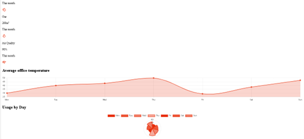
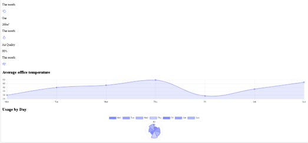

##  **EMS Theme Documentation**

### **1\. The Theme Core Architecture**

The dashboard uses a **State-to-Variable pipeline**. Instead of hardcoding colors into multiple CSS files, we use a central JavaScript configuration that injects values into the browser's global CSS scope.

### **2\. Configuration Entry Point**

All visual branding is controlled via src/themeConfig.js. This is the only file a developer needs to modify to rebrand the entire system.

```js
// src/themeConfig.js
export const DEVELOPER_THEME = {
  primary: '#E82E09',    // Changing this updates the entire app
  background: '#f8f9ff', // Main page surface
  cardBg: '#ffffff',     // Component container background
  textMain: '#1e293b',   // Primary typography color
};
```
### **3\. How the Synchronization Works**

#### **A. The CSS Variable Bridge (useTheme.js)**

The useTheme hook acts as a bridge. It reads the DEVELOPER\_THEME object and uses the DOM API to set CSS Custom Properties (Variables) on the :root element.

```js
// Internal Logic  
root.style.setProperty('--ems-primary', DEVELOPER\_THEME.primary);
```

* **Result:** Any CSS rule using var(--ems-primary) updates instantly.

### **B. Component Styling (MetricCard.jsx)**

KPI cards and icons do not have fixed colors. They "listen" to the bridge via CSS variables.

```HTML  
<div style={{ color: 'var(--ems-primary)' }}>  
    <Icon />  
</div>
```
#### **C. Chart Integration (EnergyChart.jsx)**

Charts are rendered on a \<canvas\>, which cannot read CSS variables directly. To solve this, the primaryColor is passed as a **React Prop**. When the developer changes the config, React detects the prop change and triggers a Chart.update().

| Layer | Method | Reference |
| :---- | :---- | :---- |
| **UI Layout** | CSS Variables | var(--ems-primary) |
| **Icons/KPIs** | Inline Styles | style={{color: '...'}} |
| **Charts** | React Props | borderColor: primaryColor |

### **4\. Step-by-Step: Changing the Theme**

To change the dashboard from **Red** to **Blue**:

* Open src/themeConfig.js.  
* Update the primary key:  
  ```  
  primary: '#0052FF', // color to Blue ``` 
* Save the file.  

Sample Images:



Color changed to blue:

